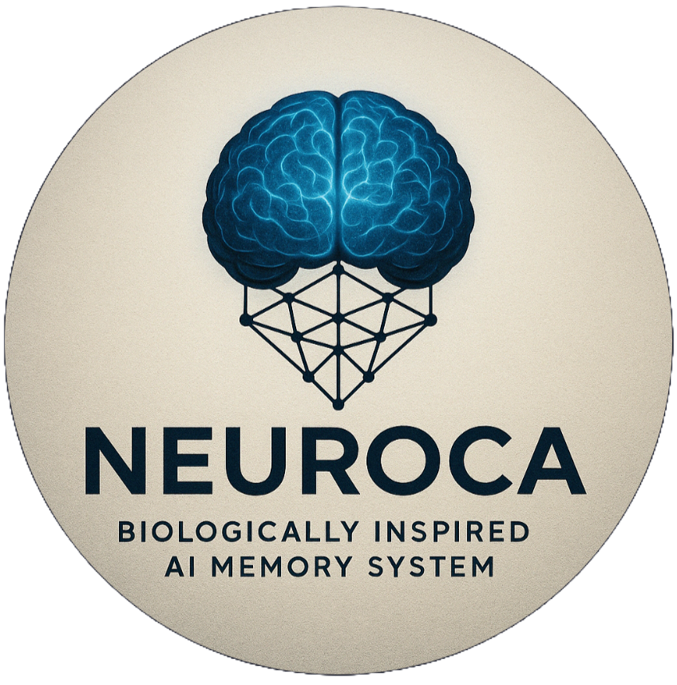

<p align="center">
  
</p>

<h3 align="center"><i>Persistent Memory System for LLMs (NCA)</i></h3>

<p align="center">
  <a href="LICENSE"></a>
  &nbsp; <a href="https://www.python.org/downloads/"></a>
</p>

<br/> 

<h2 align="center">Overview</h2>

<p align="center">
  NeuroCognitive Architecture (NCA) is an advanced framework designed to imbue Large Language Models (LLMs) with more sophisticated, human-like cognitive capabilities. It transcends standard Retrieval-Augmented Generation (RAG) by replacing fixed context windows and explicit retrieval calls with a <strong>dynamic, multi-tiered memory system</strong> inspired by biological cognition. This organic system allows the LLM's effective context to grow and adapt indefinitely, fostering accurate, stable, and long-term conversational understanding. Memory management—including consolidation, decay, and relevance scoring—operates automatically in the background. This enables the LLM to genuinely <strong>learn and evolve</strong> from interactions, "experiencing" its memories organically rather than relying on external tools to fetch isolated data points.
</p>

## Key Features

- **Dynamic Multi-Tiered Memory System**: Unlike flat vector databases used in typical RAG, NCA features a structured memory hierarchy inspired by human cognition:
    - **Short-Term Memory (STM)**: High-speed, temporary storage for immediate context (akin to working memory). Governed by TTL (Time-To-Live).
    - **Medium-Term Memory (MTM)**: Intermediate storage for recently relevant information, acting as a buffer before long-term consolidation. Managed by capacity limits and decay.
    - **Long-Term Memory (LTM)**: Persistent storage for consolidated knowledge and core facts. Supports efficient retrieval over large datasets.
- **Biologically-Inspired Processes**:
    - **Memory Consolidation**: Automatic background process to move important memories from STM -> MTM -> LTM based on relevance, frequency, and importance scores.
    - **Memory Decay**: Memories naturally lose relevance over time unless reinforced, mimicking forgetting and keeping the memory system focused.
    - **Importance Scoring**: Allows explicit weighting of memories, influencing retrieval and consolidation priority.
- **Rich Memory Representation**: Stores not just content embeddings but also crucial metadata like timestamps, sources, tags, and importance scores, enabling more complex querying and context association.
- **Dynamically Managed Backends**: The system automatically selects and manages the optimal storage backend (e.g., high-speed In-Memory for STM, persistent SQLite/Vector DBs for MTM/LTM) for each memory tier based on configuration. This happens transparently, ensuring the best balance of speed, persistence, and scalability for different types of memory without manual intervention. The architecture is designed for easy extension with new backend types.
- **Advanced Search Capabilities**: Goes beyond simple vector similarity to allow filtering and searching based on metadata, time, importance, and tags across different memory tiers.
- **Thread-Safe Design**: Engineered for robust performance in asynchronous applications with thread-local connection management for database backends.
- **Organic Learning & Context**: Facilitates true learning and adaptation by allowing the LLM's effective context to grow organically and potentially indefinitely. Unlike RAG's manual retrieval, NCA's automatic background processes (consolidation, decay, relevance-based retrieval) provide context seamlessly, enabling the LLM to evolve its understanding over time based on its "experiences" without explicit tool intervention.

## NCA vs. Standard RAG: A Deeper Dive

While standard Retrieval-Augmented Generation (RAG) enhances LLMs by fetching external data, NCA offers a fundamentally more dynamic and integrated approach to memory and context:

| Feature             | Standard RAG                                     | NeuroCognitive Architecture (NCA)                                     | Example Advantage                                                                                                |
| :------------------ | :----------------------------------------------- | :-------------------------------------------------------------------- | :--------------------------------------------------------------------------------------------------------------- |
| **Memory Structure** | Typically a flat vector database.                | Multi-tiered (STM, MTM, LTM) mimicking cognitive processes.           | NCA can prioritize recent info (STM) while retaining core knowledge (LTM), unlike a single-pool vector DB.       |
| **Context Handling** | Relies on fixed context windows & explicit retrieval calls. | Context grows organically; relevant memories surface automatically. | NCA avoids abrupt context loss; past relevant details (e.g., user preferences) remain accessible indefinitely. |
| **Info Lifecycle**   | Data is often static until manually updated.     | Memories consolidate, decay, and are updated based on interactions. | In NCA, outdated information naturally fades, while frequently used info strengthens, keeping context relevant. |
| **Retrieval**       | Primarily vector similarity search.              | Multi-faceted search (similarity, metadata, time, importance, tags).  | NCA can find memories "from last Tuesday about Project X" not just semantically similar text.                  |
| **Learning**        | Limited to the static data retrieved.            | Learns implicitly through memory dynamics and consolidation.          | NCA adapts its knowledge base over time based on ongoing interactions, reflecting genuine learning.            |
| **Integration**     | Often requires separate tool calls for retrieval. | Memory management (incl. backend selection) is integrated; context provided seamlessly. | LLM interacts more naturally with NCA, as memory (across dynamically managed backends) feels intrinsic. |

In essence, where standard RAG bolts on an external database, NCA integrates a dynamic, self-maintaining cognitive memory system, enabling LLMs to develop a more persistent, adaptive, and nuanced understanding of context over time.

- **Health Dynamics (Planned)**:
  - Energy management and resource allocation
  - Attention and focus mechanisms
  - Cognitive load monitoring and adaptation

- **Biological Inspiration**:
  - Neural pathway simulation
  - Neurotransmitter-inspired state management
  - Circadian rhythm effects on performance

- **LLM Integration**:
  - Seamless integration with popular LLM frameworks
  - Prompt engineering and context management
  - Response optimization based on cognitive state

## Architecture

The NCA system is structured around modular components that work together to create a cohesive cognitive framework:

```
neuroca/
├── api/                  # API layer and endpoints
├── cli/                  # Command-line interface tools
├── config/               # Configuration files and settings
├── core/                 # Core domain logic and models
├── db/                   # Database migrations and schemas
├── docs/                 # Documentation
├── infrastructure/       # Infrastructure as code
├── integration/          # LLM integration components
├── memory/               # Memory tier implementations
├── monitoring/           # Monitoring and observability
├── scripts/              # Utility scripts
├── tests/                # Test suite
├── tools/                # Development and operational tools
```

## Installation

### Prerequisites

- Python 3.9+
- Docker and Docker Compose (for containerized deployment)
- Access to LLM API credentials (if using external models)

### Using Poetry (Recommended)

```bash
# Clone the repository
git clone https://github.com/justinlietz93/Neuro-Cognitive-Architecture.git
cd Neuro-Cognitive-Architecture

# Install dependencies using Poetry
poetry install

# Activate the virtual environment
poetry shell
```

### Using Pip

```bash
# Clone the repository
git clone https://github.com/justinlietz93/Neuro-Cognitive-Architecture.git
cd Neuro-Cognitive-Architecture

# Create and activate a virtual environment
python -m venv venv
source venv/bin/activate  # On Windows: venv\Scripts\activate

# Install dependencies
pip install -r requirements.txt
```

### Using Docker

```bash
# Clone the repository
git clone https://github.com/justinlietz93/Neuro-Cognitive-Architecture.git
cd Neuro-Cognitive-Architecture

# Build and run with Docker Compose
docker-compose up -d
```

## Configuration

1. Copy the example environment file:
   ```bash
   cp .env.example .env
   ```

2. Edit the `.env` file with your specific configuration:
   - LLM API credentials
   - Database connection details
   - Memory system parameters
   - Health dynamics settings

3. Additional configuration options are available in the `config/` directory.

## Usage

### API

Start the API server:

```bash
make run-api
# or
python -m neuroca.api.server
```

The API will be available at `http://localhost:8000` by default.

### CLI

The NCA system provides a command-line interface for direct interaction:

```bash
# Get help
neuroca --help

# Initialize a new cognitive session
neuroca session init

# Process input through the cognitive architecture
neuroca process "Your input text here"

# View memory contents
neuroca memory list --type=working
```

### Python Library

```python
from neuroca import NeuroCognitiveArchitecture

# Initialize the architecture
nca = NeuroCognitiveArchitecture()

# Configure memory parameters
nca.configure(
    working_memory_capacity=7,
    episodic_decay_rate=0.05,
    semantic_consolidation_threshold=0.8
)

# Process input through the cognitive architecture
response = nca.process("What is the relationship between quantum physics and consciousness?")

# Access memory components
working_memory = nca.memory.working.get_contents()
```

## Development

### Setting Up Development Environment

```bash
# Install development dependencies
poetry install --with dev

# Set up pre-commit hooks
pre-commit install
```

### Running Tests

```bash
# Run all tests
make test
# or
pytest

# Run specific test modules
pytest tests/memory/
```

### Code Quality

```bash
# Run linting
make lint
# or
flake8 neuroca tests

# Run type checking
make typecheck
# or
mypy neuroca
```

## Documentation

Comprehensive documentation is available in the `docs/` directory and can be built using Sphinx:

```bash
cd docs
make html
```

The built documentation will be available at `docs/_build/html/index.html`.

## Contributing

We welcome contributions to the NeuroCognitive Architecture project! Please see [CONTRIBUTING.md](CONTRIBUTING.md) for guidelines on how to contribute.

### Development Workflow

1. Fork the repository
2. Create a feature branch (`git checkout -b feature/amazing-feature`)
3. Commit your changes (`git commit -m 'Add amazing feature'`)
4. Push to the branch (`git push origin feature/amazing-feature`)
5. Open a Pull Request

## Roadmap

- **Phase 1**: Core memory system implementation
- **Phase 2**: Health dynamics integration
- **Phase 3**: Advanced biological components
- **Phase 4**: LLM integration optimization
- **Phase 5**: Performance tuning and scaling

## Future Directions & Integrations

The NCA project is actively evolving. Key areas for future development include:

- **Advanced Cognitive Features**: Implementing more nuanced cognitive functions like attention mechanisms, emotional modeling, and more sophisticated learning algorithms.
- **Performance Optimization**: Continuously improving the speed and efficiency of memory operations, particularly for large-scale deployments. This includes optimizing database interactions, refining consolidation algorithms, and exploring hardware acceleration options.
- **Benchmarking**: Conducting rigorous benchmarks comparing NCA's performance (speed, scalability, retrieval accuracy, context quality) against other popular memory systems and RAG frameworks.
- **Expanded Backend Support**: Adding support for more database and vector store backends (e.g., PostgreSQL, Redis, specialized vector databases like Weaviate or Pinecone) to provide greater flexibility.
- **Framework Compatibility & Integrations**:
    - **LangChain**: Enhancing the native integration with LangChain, providing seamless compatibility with LangChain's ecosystem of tools and agents. We aim to offer NCA as a sophisticated, stateful memory alternative within LangChain workflows.
    - **Other Frameworks**: Exploring integrations with other popular AI/LLM frameworks (e.g., LlamaIndex, Haystack) to broaden NCA's applicability.
- **Enhanced Tooling**: Developing better tools for monitoring memory state, debugging cognitive processes, and visualizing memory dynamics.

## License

This project is licensed under the MIT License - see the [LICENSE](LICENSE) file for details.

## Acknowledgments

- Cognitive science research that inspired this architecture
- The open-source AI community
- Contributors and early adopters

## Author

- **Justin Lietz** - *Initial work & Lead Developer*

## Contact

For questions, feedback, or collaboration opportunities, please open an issue on this repository or contact Justin Lietz.

---

**Note**: NeuroCognitive Architecture is a research project and is continuously evolving. Features and interfaces may change as the project develops.
