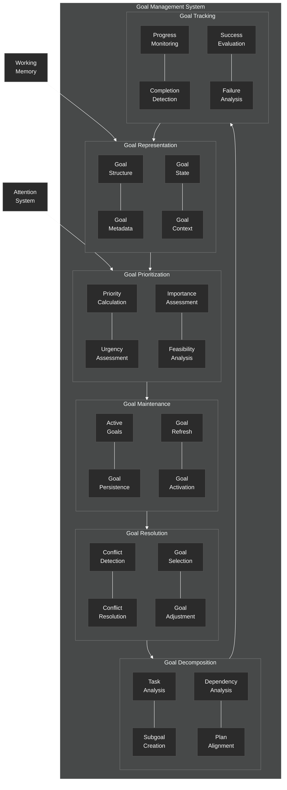

# Goal Management System

This diagram details the goal management component of the NeuroCognitive Architecture (NCA) cognitive control system.

## Goal Management System Components

The Goal Management System is responsible for representing, prioritizing, maintaining, and tracking goals within the cognitive architecture. It includes the following key components:

### Goal Representation
- **Goal Structure**: Defines the format and components of a goal
- **Goal Metadata**: Additional information about the goal (creation time, source, etc.)
- **Goal State**: Current status of the goal (active, completed, failed, etc.)
- **Goal Context**: The context in which the goal is relevant

### Goal Prioritization
- **Priority Calculation**: Determines the relative importance of goals
- **Urgency Assessment**: Evaluates time sensitivity of goals
- **Importance Assessment**: Evaluates value or significance of goals
- **Feasibility Analysis**: Assesses the likelihood of successful goal completion

### Goal Maintenance
- **Active Goals**: Manages the set of currently active goals
- **Goal Persistence**: Maintains goals over time
- **Goal Refresh**: Updates goal information as context changes
- **Goal Activation**: Activates relevant goals based on context

### Goal Resolution
- **Conflict Detection**: Identifies conflicts between competing goals
- **Conflict Resolution**: Resolves conflicts through prioritization or compromise
- **Goal Selection**: Chooses which goals to pursue when resources are limited
- **Goal Adjustment**: Modifies goals based on changing conditions

### Goal Decomposition
- **Task Analysis**: Breaks down goals into manageable components
- **Subgoal Creation**: Creates subordinate goals that support the main goal
- **Dependency Analysis**: Identifies dependencies between goals and subgoals
- **Plan Alignment**: Ensures subgoals align with the overall plan

### Goal Tracking
- **Progress Monitoring**: Tracks progress toward goal completion
- **Completion Detection**: Identifies when goals have been achieved
- **Success Evaluation**: Assesses the degree of success in goal achievement
- **Failure Analysis**: Analyzes reasons for goal failure

The Goal Management System interacts with the Working Memory to store active goals and with the Attention System to direct focus toward high-priority goals. It maintains a continuous feedback loop between goal tracking and representation to adapt goals based on progress and changing conditions.
