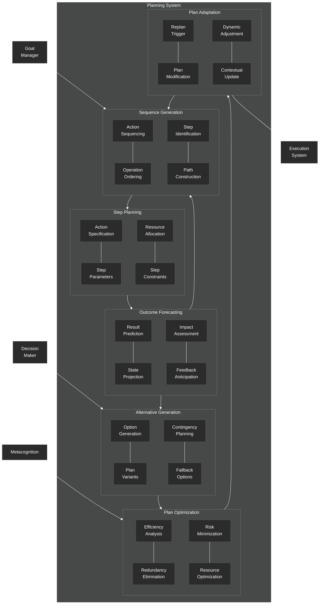

# Planning System

This diagram details the planning component of the NeuroCognitive Architecture (NCA) cognitive control system.

## Planning System Components

The Planning System is responsible for generating, evaluating, optimizing, and adapting plans to achieve goals. It includes the following key components:

### Sequence Generation
- **Action Sequencing**: Determines the order of actions in a plan
- **Operation Ordering**: Orders lower-level operations within actions
- **Step Identification**: Identifies the necessary steps to achieve a goal
- **Path Construction**: Builds the sequence of steps forming the plan

### Step Planning
- **Action Specification**: Defines the details of each action in the plan
- **Step Parameters**: Specifies parameters required for each step
- **Resource Allocation**: Assigns resources needed for each step
- **Step Constraints**: Defines constraints and conditions for each step

### Outcome Forecasting
- **Result Prediction**: Predicts the likely outcome of executing the plan
- **State Projection**: Forecasts the system state after plan execution
- **Impact Assessment**: Evaluates the potential impact of the plan
- **Feedback Anticipation**: Predicts expected feedback during execution

### Alternative Generation
- **Option Generation**: Creates alternative actions or steps
- **Plan Variants**: Develops different versions of the plan
- **Contingency Planning**: Creates backup plans for potential failures
- **Fallback Options**: Defines alternative actions if primary steps fail

### Plan Optimization
- **Efficiency Analysis**: Evaluates the efficiency of the plan
- **Redundancy Elimination**: Removes unnecessary steps or actions
- **Risk Minimization**: Modifies the plan to reduce potential risks
- **Resource Optimization**: Optimizes the use of resources in the plan

### Plan Adaptation
- **Replan Trigger**: Detects conditions requiring plan modification
- **Plan Modification**: Alters the plan based on new information or feedback
- **Dynamic Adjustment**: Makes real-time adjustments during execution
- **Contextual Update**: Updates the plan based on changes in the environment or context

The Planning System receives goals from the Goal Manager, uses the Decision Maker for evaluating alternatives, and is monitored by the Metacognition system for optimization. It produces plans for the Execution System.
