# Cognitive Control Overview

This diagram provides a comprehensive overview of the NeuroCognitive Architecture (NCA) cognitive control system.

```mermaid
%%{init: {'theme': 'dark', 'themeVariables': { 'primaryColor': '#242424', 'primaryTextColor': '#fff', 'primaryBorderColor': '#555', 'lineColor': '#f8f8f8', 'secondaryColor': '#2b2b2b', 'tertiaryColor': '#1a1a1a'}}}%%
graph TB
    classDef main fill:#1a1a1a,stroke:#555,color:#fff
    classDef component fill:#242424,stroke:#555,color:#fff
    classDef subcomponent fill:#2b2b2b,stroke:#555,color:#fff
    classDef attention fill:#203040,stroke:#555,color:#fff
    classDef decision fill:#302030,stroke:#555,color:#fff
    classDef goal fill:#203020,stroke:#555,color:#fff
    classDef inhibition fill:#302020,stroke:#555,color:#fff
    classDef metacognition fill:#203030,stroke:#555,color:#fff
    classDef planning fill:#302010,stroke:#555,color:#fff

    subgraph CognitiveControl["NCA Cognitive Control System"]
        direction TB
        class CognitiveControl main
        
        subgraph CoreComponents["Core Cognitive Components"]
            direction TB
            class CoreComponents component
            
            subgraph AttentionManager["Attention Manager"]
                direction TB
                class AttentionManager attention
                Focus[Focus<br>Control] --- Filtering[Sensory<br>Filtering]
                Salience[Salience<br>Detection] --- ResourceAllocation[Resource<br>Allocation]
                Spotlight[Attention<br>Spotlight] --- Shifting[Attention<br>Shifting]
                class Focus,Filtering,Salience,ResourceAllocation,Spotlight,Shifting subcomponent
            end
            
            subgraph DecisionMaker["Decision Maker"]
                direction TB
                class DecisionMaker decision
                Evaluation[Option<br>Evaluation] --- Selection[Option<br>Selection]
                Reasoning[Logical<br>Reasoning] --- Inference[Inference<br>Engine]
                Utility[Utility<br>Calculation] --- Biases[Cognitive<br>Biases]
                class Evaluation,Selection,Reasoning,Inference,Utility,Biases subcomponent
            end
            
            subgraph GoalManager["Goal Manager"]
                direction TB
                class GoalManager goal
                Representation[Goal<br>Representation] --- Prioritization[Goal<br>Prioritization]
                Maintenance[Goal<br>Maintenance] --- Conflict[Conflict<br>Resolution]
                Decomposition[Goal<br>Decomposition] --- Tracking[Goal<br>Tracking]
                class Representation,Prioritization,Maintenance,Conflict,Decomposition,Tracking subcomponent
            end
            
            subgraph Inhibitor["Inhibitor"]
                direction TB
                class Inhibitor inhibition
                Response[Response<br>Inhibition] --- Distractor[Distractor<br>Suppression]
                Interference[Interference<br>Control] --- Prepotent[Prepotent<br>Inhibition]
                Cognitive[Cognitive<br>Suppression] --- Emotional[Emotional<br>Regulation]
                class Response,Distractor,Interference,Prepotent,Cognitive,Emotional subcomponent
            end
            
            subgraph Metacognition["Metacognition"]
                direction TB
                class Metacognition metacognition
                SelfMonitoring[Self<br>Monitoring] --- Reflection[Reflection<br>System]
                ErrorDetection[Error<br>Detection] --- Adaptation[Strategy<br>Adaptation]
                Confidence[Confidence<br>Estimation] --- Introspection[Introspection<br>System]
                class SelfMonitoring,Reflection,ErrorDetection,Adaptation,Confidence,Introspection subcomponent
            end
            
            subgraph Planner["Planner"]
                direction TB
                class Planner planning
                SequenceGen[Sequence<br>Generation] --- StepPlanning[Step<br>Planning]
                Forecasting[Outcome<br>Forecasting] --- Alternative[Alternative<br>Generation]
                Optimization[Plan<br>Optimization] --- Adaptation[Plan<br>Adaptation]
                class SequenceGen,StepPlanning,Forecasting,Alternative,Optimization,Adaptation subcomponent
            end
        end
        
        subgraph ExecutiveFunction["Executive Function"]
            direction TB
            class ExecutiveFunction component
            TaskSwitching[Task<br>Switching] --- WorkingMemoryControl[Working Memory<br>Control]
            InhibitoryControl[Inhibitory<br>Control] --- CognitiveFlexibility[Cognitive<br>Flexibility]
            class TaskSwitching,WorkingMemoryControl,InhibitoryControl,CognitiveFlexibility subcomponent
        end
        
        subgraph CognitiveProcesses["Cognitive Processes"]
            direction TB
            class CognitiveProcesses component
            ProblemSolving[Problem<br>Solving] --- CriticalThinking[Critical<br>Thinking]
            ReasoningProcess[Reasoning<br>Process] --- Creativity[Creativity<br>Process]
            class ProblemSolving,CriticalThinking,ReasoningProcess,Creativity subcomponent
        end
        
        subgraph ResourceManagement["Resource Management"]
            direction TB
            class ResourceManagement component
            Allocation[Resource<br>Allocation] --- Monitoring[Resource<br>Monitoring]
            Prioritization[Resource<br>Prioritization] --- Conservation[Resource<br>Conservation]
            class Allocation,Monitoring,Prioritization,Conservation subcomponent
        end
    end
    
    %% External connections
    MemorySystem[Memory<br>System] --- AttentionManager
    MemorySystem --- GoalManager
    HealthSystem[Health<br>System] --- ResourceManagement
    HealthSystem --- Metacognition
    
    %% Core component connections
    AttentionManager --> DecisionMaker
    DecisionMaker --> GoalManager
    GoalManager --> Planner
    
    %% Inhibitory connections
    Inhibitor --> AttentionManager
    Inhibitor --> DecisionMaker
    
    %% Metacognitive connections
    Metacognition --> AttentionManager
    Metacognition --> DecisionMaker
    Metacognition --> Planner
    Metacognition --> GoalManager
    
    %% Resource management
    ResourceManagement --> AttentionManager
    ResourceManagement --> DecisionMaker
    ResourceManagement --> Planner
    
    %% Executive function
    ExecutiveFunction --> AttentionManager
    ExecutiveFunction --> Inhibitor
    ExecutiveFunction --> GoalManager
    
    %% Integration with cognitive processes
    CognitiveProcesses --> DecisionMaker
    CognitiveProcesses --> Planner
    
    %% Output connections
    DecisionMaker --> Action[Action<br>Selection]
    Planner --> Execution[Plan<br>Execution]
    
    %% Node styling
    class MemorySystem,HealthSystem,Action,Execution subcomponent
```

## Cognitive Control System Components

The NCA cognitive control system provides the mechanisms for attention, reasoning, decision-making, and executive function. It is designed with inspiration from human cognitive neuroscience and includes the following key components:

### Core Cognitive Components

1. **Attention Manager**:
   - **Focus Control**: Directs and maintains focus on relevant information
   - **Sensory Filtering**: Filters out irrelevant sensory information
   - **Salience Detection**: Identifies important or novel stimuli
   - **Resource Allocation**: Distributes cognitive resources based on attention priorities
   - **Attention Spotlight**: Concentrates processing on specific information
   - **Attention Shifting**: Moves focus between different information sources

2. **Decision Maker**:
   - **Option Evaluation**: Assesses potential decision options
   - **Option Selection**: Chooses optimal actions based on evaluation
   - **Logical Reasoning**: Applies logical rules to decision-making
   - **Inference Engine**: Draws conclusions from available information
   - **Utility Calculation**: Computes expected value of potential decisions
   - **Cognitive Biases**: Models human-like cognitive biases

3. **Goal Manager**:
   - **Goal Representation**: Maintains internal representation of goals
   - **Goal Prioritization**: Determines relative importance of competing goals
   - **Goal Maintenance**: Keeps goals active over time
   - **Conflict Resolution**: Resolves conflicts between competing goals
   - **Goal Decomposition**: Breaks down high-level goals into subgoals
   - **Goal Tracking**: Monitors progress toward goal completion

4. **Inhibitor**:
   - **Response Inhibition**: Suppresses inappropriate responses
   - **Distractor Suppression**: Reduces interference from distracting information
   - **Interference Control**: Manages interference between competing processes
   - **Prepotent Inhibition**: Controls automatic or habitual responses
   - **Cognitive Suppression**: Inhibits irrelevant thoughts or memory activations
   - **Emotional Regulation**: Modulates emotional influences on cognition

5. **Metacognition**:
   - **Self-Monitoring**: Monitors own cognitive processes
   - **Reflection System**: Analyzes past decisions and processes
   - **Error Detection**: Identifies errors in processing or decision-making
   - **Strategy Adaptation**: Adjusts cognitive strategies based on performance
   - **Confidence Estimation**: Assesses confidence in decisions or knowledge
   - **Introspection System**: Examines internal states and processes

6. **Planner**:
   - **Sequence Generation**: Creates sequences of actions to achieve goals
   - **Step Planning**: Determines individual steps in a plan
   - **Outcome Forecasting**: Predicts consequences of planned actions
   - **Alternative Generation**: Develops alternative plans
   - **Plan Optimization**: Improves plans for efficiency and effectiveness
   - **Plan Adaptation**: Adjusts plans in response to changing conditions

### Supporting Systems

1. **Executive Function**:
   - Coordinates task switching, working memory control, inhibitory control, and cognitive flexibility

2. **Cognitive Processes**:
   - Implements problem-solving, critical thinking, reasoning, and creativity

3. **Resource Management**:
   - Handles allocation, monitoring, prioritization, and conservation of cognitive resources

### Integration with Other NCA Systems

The cognitive control system integrates with:
- **Memory System**: For retrieving and storing information
- **Health System**: For monitoring and regulating cognitive resource usage

### Output Systems

The cognitive control system produces:
- **Action Selection**: Final decisions about which actions to take
- **Plan Execution**: Sequences of actions to achieve goals

The cognitive control system exhibits a hierarchical organization, with metacognition providing oversight of all other cognitive processes, similar to the supervisory role of the prefrontal cortex in human cognition.
