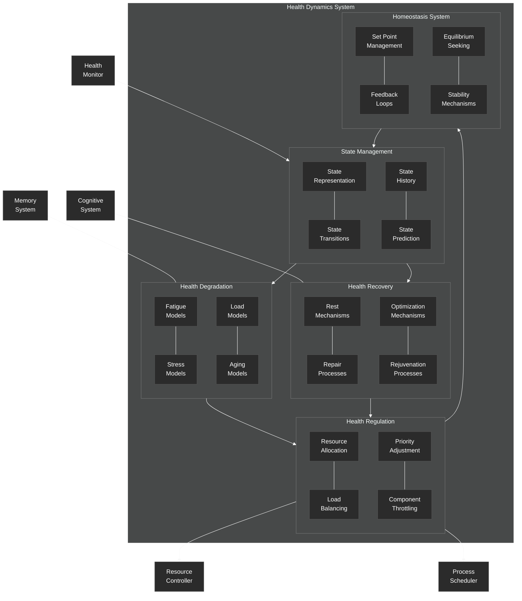

# Health Dynamics System

Details of the health dynamics system in the NeuroCognitive Architecture.

## Health Dynamics System Components

The Health Dynamics System models and regulates the operational health of the NeuroCognitive Architecture using mechanisms inspired by biological homeostasis.

### State Management
- **State Representation**: Models the current health state of the system
- **State Transitions**: Manages transitions between different health states
- **State History**: Maintains a history of past health states
- **State Prediction**: Predicts future health states based on current trends

### Health Degradation
- **Fatigue Models**: Simulates system fatigue under continuous operation
- **Stress Models**: Models the impact of high load or pressure on system health
- **Load Models**: Represents the relationship between load and system health
- **Aging Models**: Simulates longer-term degradation of system capabilities

### Health Recovery
- **Rest Mechanisms**: Simulates recovery during periods of low activity
- **Repair Processes**: Models self-repair capabilities of the system
- **Optimization Mechanisms**: Represents efficiency improvements after recovery
- **Rejuvenation Processes**: Simulates periodic deep recovery processes

### Health Regulation
- **Resource Allocation**: Adjusts resource allocation based on health state
- **Load Balancing**: Redistributes load to maintain system health
- **Priority Adjustment**: Modifies task priorities based on health considerations
- **Component Throttling**: Reduces activity of overloaded components

### Homeostasis System
- **Set Point Management**: Maintains optimal health parameters
- **Feedback Loops**: Implements negative feedback to maintain stability
- **Equilibrium Seeking**: Works to return the system to a balanced state
- **Stability Mechanisms**: Prevents oscillations and instability

The Health Dynamics System receives health state information from the Health Monitor and interacts with the Memory and Cognitive Systems to model their health degradation and recovery. It outputs control signals to the Resource Controller and Process Scheduler to regulate system operation.
