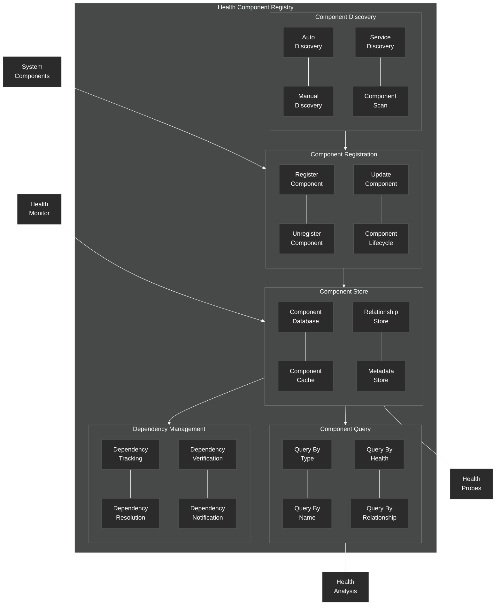

# Health Component Registry

Details of the health component registry in the NeuroCognitive Architecture.

## Health Component Registry Components

The Health Component Registry manages the registration, discovery, and tracking of components within the NeuroCognitive Architecture that participate in the health system.

### Component Registration
- **Register Component**: Adds components to the health system
- **Unregister Component**: Removes components from the health system
- **Update Component**: Updates component information
- **Component Lifecycle**: Manages component lifecycle events

### Component Discovery
- **Auto Discovery**: Automatically discovers eligible components
- **Manual Discovery**: Allows manual addition of components
- **Service Discovery**: Discovers components via service discovery mechanisms
- **Component Scan**: Scans the system for eligible components

### Component Store
- **Component Database**: Persistent storage for component information
- **Component Cache**: In-memory cache for faster access
- **Relationship Store**: Stores relationships between components
- **Metadata Store**: Stores health-related metadata for components

### Component Query
- **Query By Type**: Finds components by their type
- **Query By Name**: Retrieves components by name
- **Query By Health**: Queries components by health status
- **Query By Relationship**: Finds components based on their relationships

### Dependency Management
- **Dependency Tracking**: Tracks dependencies between components
- **Dependency Resolution**: Resolves dependency references
- **Dependency Verification**: Verifies dependency health and availability
- **Dependency Notification**: Notifies components of dependency changes

The Component Registry interacts with all System Components for registration, and with the Health Monitor for health status updates. It provides component information to Health Probes for monitoring and to Health Analysis for context-aware analysis.
