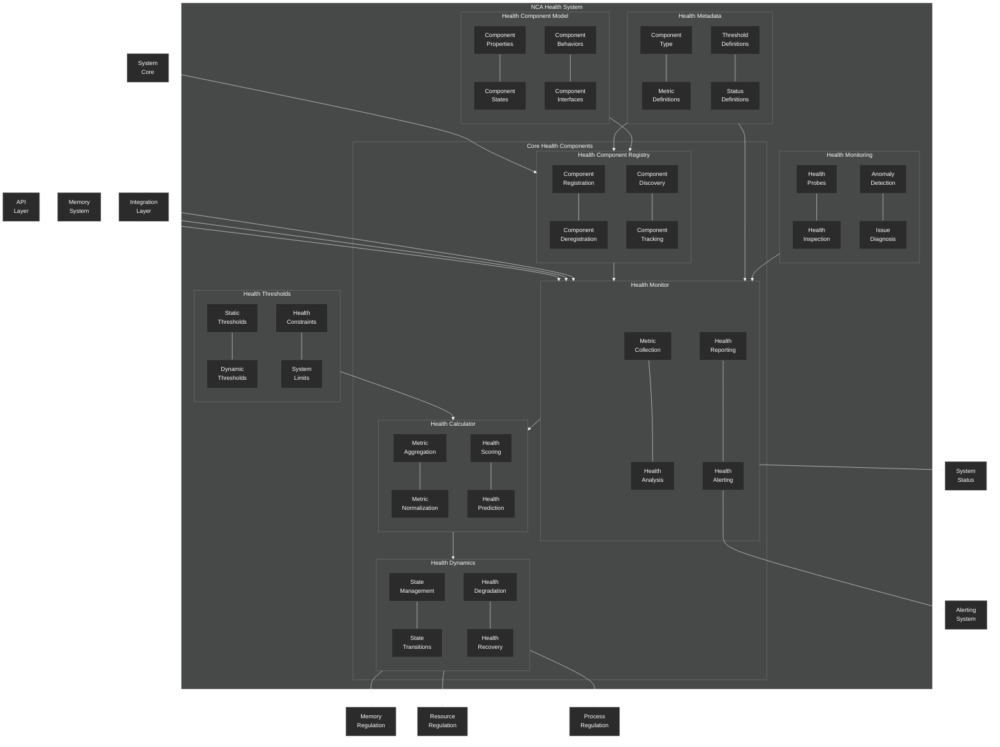

# Health System Overview

This diagram provides a comprehensive overview of the NeuroCognitive Architecture (NCA) health system.

## Health System Components

The NCA health system provides a biologically-inspired framework for monitoring and regulating the operational state of the system. It consists of the following key components:

### Core Health Components

1. **Health Component Registry**:
   - **Component Registration/Deregistration**: Manages the lifecycle of health-monitored components
   - **Component Discovery**: Finds and tracks health-relevant components in the system
   - **Component Tracking**: Maintains the current state of registered components

2. **Health Monitor**:
   - **Metric Collection**: Gathers health-related metrics from system components
   - **Health Analysis**: Analyzes metrics to determine system health
   - **Health Reporting**: Generates health reports for system components
   - **Health Alerting**: Raises alerts when health issues are detected

3. **Health Dynamics**:
   - **State Management**: Manages the health state of the system and its components
   - **State Transitions**: Handles transitions between different health states
   - **Health Degradation**: Models gradual health deterioration
   - **Health Recovery**: Models recovery processes after health degradation

4. **Health Calculator**:
   - **Metric Aggregation**: Combines metrics from different components
   - **Metric Normalization**: Standardizes metrics to comparable scales
   - **Health Scoring**: Calculates health scores for components
   - **Health Prediction**: Forecasts future health states based on trends

### Supporting Components

1. **Health Metadata**:
   - Defines component types, metrics, thresholds, and status definitions

2. **Health Thresholds**:
   - Defines static and dynamic thresholds for health metrics
   - Specifies constraints and limits for system operation

3. **Health Component Model**:
   - Defines the properties, states, behaviors, and interfaces for health components

4. **Health Monitoring**:
   - Implements probes, inspection, anomaly detection, and diagnosis

### External Integrations

The health system integrates with:
- **System Core**: For fundamental system operations
- **API Layer**: For exposing health status to external systems
- **Memory System**: For health-related memory operations
- **Integration Layer**: For connecting with external monitoring systems

### Regulation Mechanisms

The health system regulates:
- **Memory Regulation**: Adjusts memory operations based on health status
- **Resource Regulation**: Controls resource allocation based on health status
- **Process Regulation**: Modifies process execution based on health status

The health system is designed with biological inspiration, mirroring how biological systems monitor and regulate their internal state to maintain homeostasis and respond to stressors.
