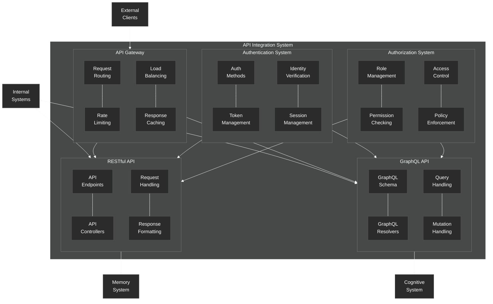

# API Integration System

Details of the API integration system in the NeuroCognitive Architecture.

## API Integration System Components

The API Integration System provides interfaces for external systems to interact with the NeuroCognitive Architecture through standardized APIs.

### RESTful API
- **API Endpoints**: Defines URL endpoints for different operations
- **API Controllers**: Handles API requests and orchestrates responses
- **Request Handling**: Processes incoming API requests
- **Response Formatting**: Formats API responses according to standards

### GraphQL API
- **GraphQL Schema**: Defines the schema for GraphQL queries and mutations
- **GraphQL Resolvers**: Resolves GraphQL queries to data sources
- **Query Handling**: Processes GraphQL queries
- **Mutation Handling**: Handles GraphQL mutations (data changes)

### Authentication System
- **Auth Methods**: Supports multiple authentication methods
- **Token Management**: Manages authentication tokens
- **Identity Verification**: Verifies the identity of API users
- **Session Management**: Manages user sessions

### Authorization System
- **Role Management**: Manages user roles and permissions
- **Permission Checking**: Checks user permissions for operations
- **Access Control**: Controls access to protected resources
- **Policy Enforcement**: Enforces security policies

### API Gateway
- **Request Routing**: Routes requests to appropriate handlers
- **Rate Limiting**: Limits request rates to prevent abuse
- **Load Balancing**: Distributes load across multiple instances
- **Response Caching**: Caches responses for improved performance

The API Integration System serves as the interface between External Clients and the NeuroCognitive Architecture's Internal Systems. It provides both RESTful and GraphQL interfaces, with Authentication and Authorization systems ensuring secure access. The API Gateway manages incoming requests, applying rate limiting and load balancing for scalability.
