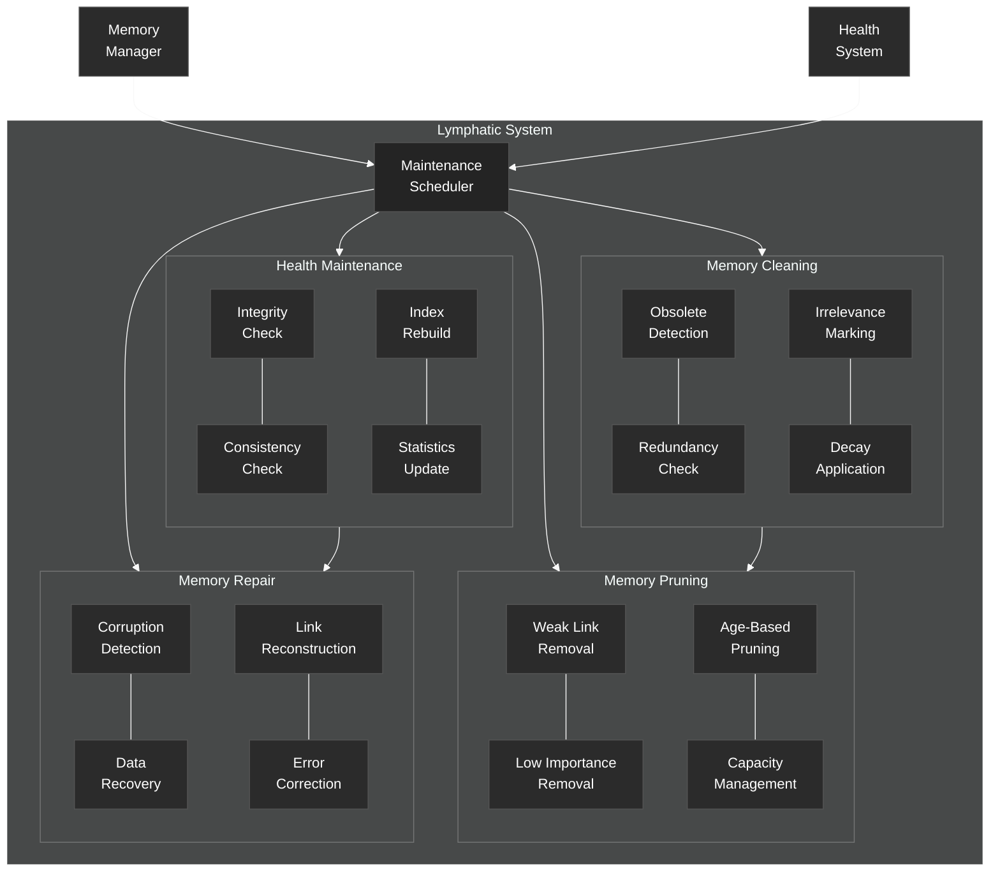

# Lymphatic System

Details of the Lymphatic System responsible for memory maintenance and cleaning.

## Lymphatic System Components

Inspired by the brain's glymphatic system, the NCA's Lymphatic System performs background maintenance tasks to keep the memory system healthy and efficient.

### Maintenance Scheduler
- Orchestrates the execution of cleaning, pruning, maintenance, and repair tasks, often during periods of low cognitive load (simulated "sleep").

### Memory Cleaning
- **Obsolete Detection**: Identifies memory items that are no longer valid or relevant.
- **Redundancy Check**: Finds and marks duplicate or redundant information.
- **Irrelevance Marking**: Flags items that have become irrelevant based on current goals or context.
- **Decay Application**: Applies decay mechanisms to reduce the strength or salience of unused items.

### Memory Pruning
- **Weak Link Removal**: Removes weak connections between memory items.
- **Low Importance Removal**: Deletes items deemed unimportant based on metadata or usage.
- **Age-Based Pruning**: Removes old items that haven't been accessed recently (configurable).
- **Capacity Management**: Prunes items to stay within storage capacity limits.

### Health Maintenance
- **Integrity Check**: Verifies the structural integrity of memory data.
- **Consistency Check**: Ensures consistency across related memory items and indexes.
- **Index Rebuild**: Rebuilds search indexes for optimal performance.
- **Statistics Update**: Updates metadata and statistics about memory usage.

### Memory Repair
- **Corruption Detection**: Identifies corrupted or damaged memory data.
- **Data Recovery**: Attempts to recover data from backups or redundant sources.
- **Link Reconstruction**: Tries to repair broken links between memory items.
- **Error Correction**: Corrects errors in memory content where possible.

The Lymphatic System is triggered by the Memory Manager, potentially influenced by the Health System's state (e.g., running more intensively during low-load periods). Its goal is to prevent memory clutter, maintain performance, and ensure data integrity.
