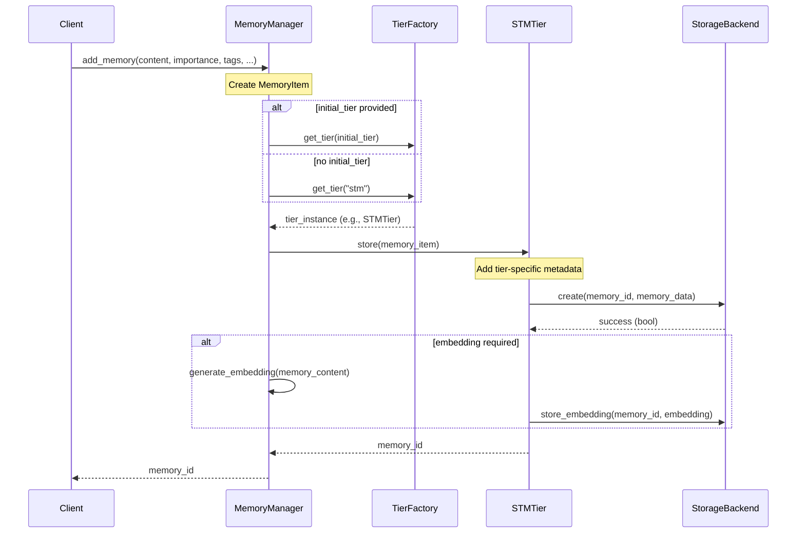
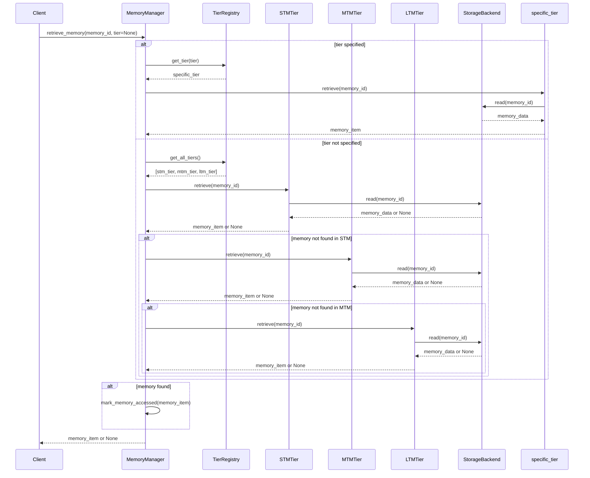
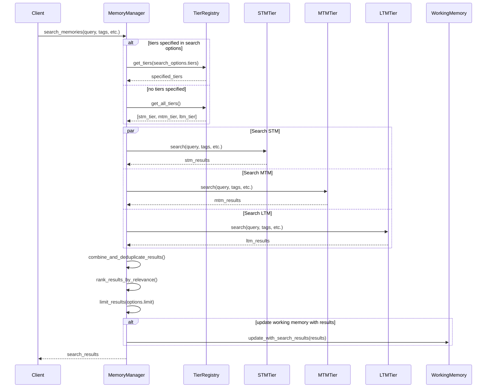
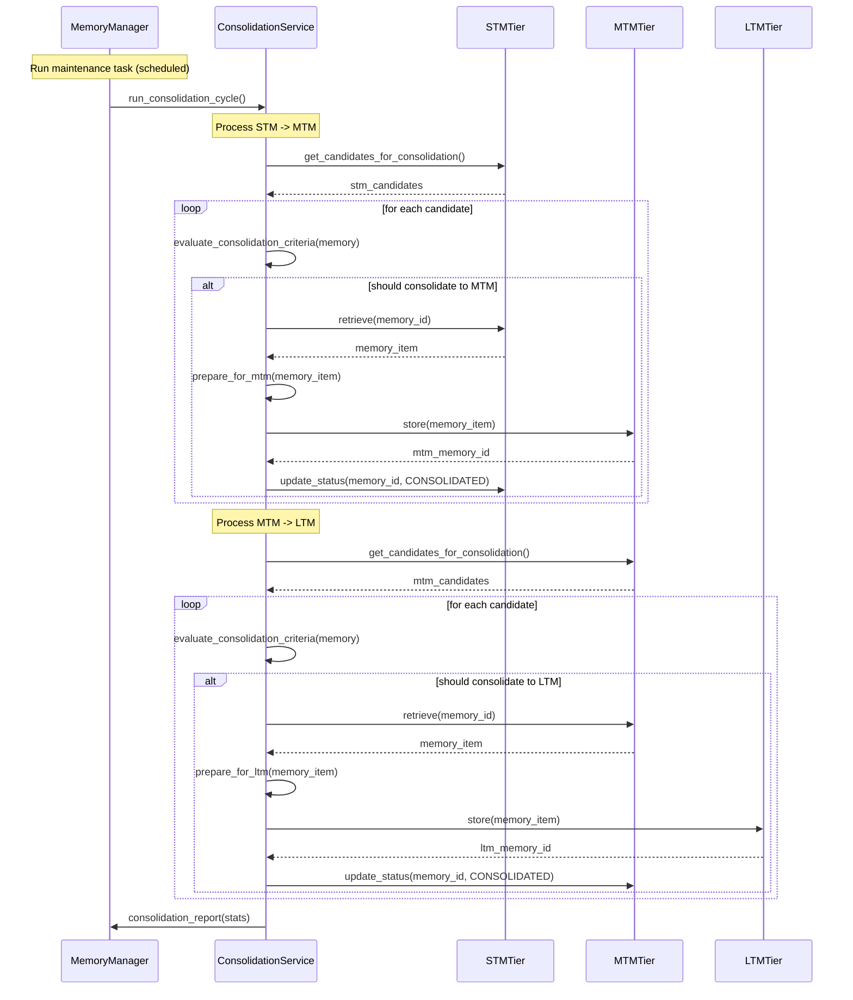
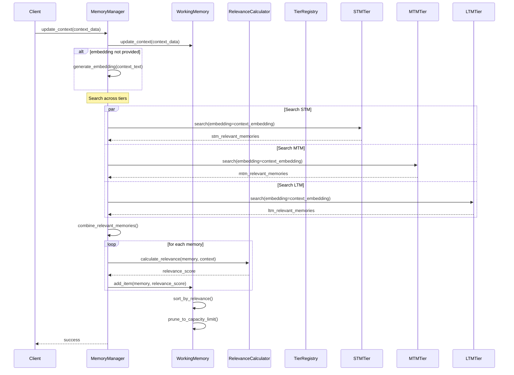
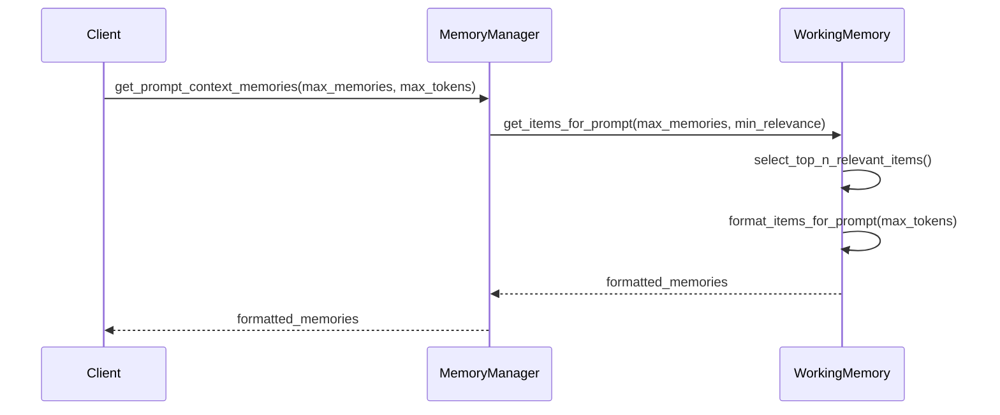

# Memory System Component Interactions

**Last Updated:** April 14, 2025

This document outlines the key interactions between components in the Neuroca memory system. These sequence diagrams illustrate how the various interfaces and components work together to implement core operations.

## Operation 1: Memory Addition

This sequence diagram illustrates the process of adding a new memory item to the system.

### Key Points:
- The MemoryManager handles validation and initial processing of the memory item
- The appropriate tier is determined (STM by default)
- The tier adds tier-specific metadata before storage
- Embeddings are generated and stored if needed
- The memory ID is returned to the client

## Operation 2: Memory Retrieval

This sequence diagram illustrates the process of retrieving a memory by ID.

### Key Points:
- If tier is specified, only that tier is searched
- If no tier is specified, tiers are searched in order: STM -> MTM -> LTM
- When a memory is found, it's marked as accessed (updating strength/access count)
- If not found in any tier, None is returned

## Operation 3: Memory Search

This sequence diagram illustrates searching for memories across tiers.

### Key Points:
- Searches can be performed across all tiers or specific tiers
- Searches are performed in parallel across tiers
- Results are combined, deduplicated and ranked by relevance
- Results can optionally update the working memory buffer
- Final results are limited according to search options

## Operation 4: Memory Consolidation

This sequence diagram illustrates the process of consolidating memories between tiers.

### Key Points:
- Consolidation runs as a scheduled maintenance task
- It processes memories in both directions: STM -> MTM and MTM -> LTM
- Each tier provides candidates for consolidation based on tier-specific criteria
- Candidates are evaluated against consolidation criteria (importance, access patterns, etc.)
- Consolidated memories are stored in the target tier with appropriate metadata
- Original memories are marked as CONSOLIDATED in the source tier

## Operation 5: Context Update and Working Memory Management

This sequence diagram illustrates updating the context and managing working memory.

### Key Points:
- Context update triggers a search for relevant memories across all tiers
- Context can be provided with a pre-computed embedding or one will be generated
- Results from all tiers are combined and their relevance to the current context is calculated
- Relevant memories are added to the working memory buffer
- The buffer is sorted by relevance and pruned to maintain its capacity limit

## Operation 6: Getting Memories for Prompt Context

This sequence diagram illustrates retrieving memories for prompt context.

### Key Points:
- Retrieving prompt context memories uses the working memory buffer
- The most relevant memories are selected based on relevance scores
- Memories are formatted appropriately for prompt inclusion
- Text content is truncated if needed to fit within token limits

## Implementation Notes

These interactions demonstrate the following design principles:

1. **Clean Separation of Concerns:**
   - MemoryManager handles orchestration
   - Tiers handle tier-specific behavior
   - Storage backends handle persistence
   - Working memory manages the context-aware buffer

2. **Async Operation:**
   - All operations are designed to be asynchronous
   - Parallel processing is used where appropriate

3. **Error Handling:**
   - Each component should propagate appropriate exceptions
   - The MemoryManager provides a clean interface with unified error handling

4. **Extensibility:**
   - New storage backends can be added without changing tiers
   - New tier implementations can be added without changing the MemoryManager
   - New consolidation or relevance algorithms can be plugged in
