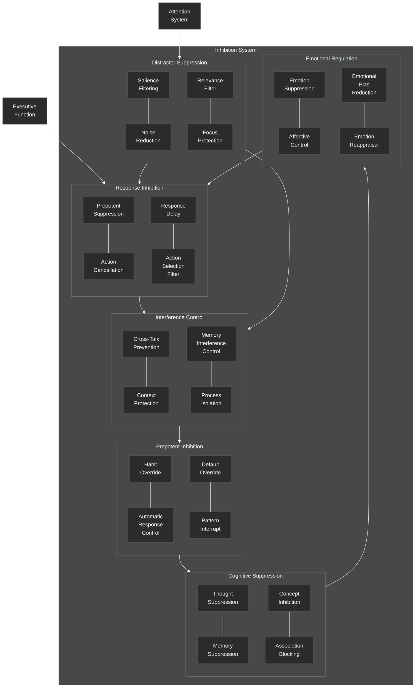

# Inhibition System

This diagram details the inhibition component of the NeuroCognitive Architecture (NCA) cognitive control system.

## Inhibition System Components

The Inhibition System is responsible for suppressing inappropriate responses, filtering distractions, and managing interference in cognitive processes. It includes the following key components:

### Response Inhibition
- **Prepotent Suppression**: Suppresses dominant or automatic responses
- **Action Cancellation**: Stops actions that have been initiated
- **Response Delay**: Introduces a delay before responding to allow for evaluation
- **Action Selection Filter**: Filters out inappropriate actions from the selection process

### Distractor Suppression
- **Salience Filtering**: Reduces the impact of salient but irrelevant stimuli
- **Noise Reduction**: Filters out background noise in sensory and cognitive processing
- **Relevance Filter**: Allows only contextually relevant information to pass through
- **Focus Protection**: Maintains attention on the current task by suppressing distractions

### Interference Control
- **Cross-Talk Prevention**: Prevents interference between concurrent processes
- **Context Protection**: Maintains the integrity of contextual information
- **Memory Interference Control**: Manages interference between memory items
- **Process Isolation**: Ensures isolation between cognitive processes that might interfere

### Prepotent Inhibition
- **Habit Override**: Overrides habitual responses in favor of goal-directed behavior
- **Automatic Response Control**: Regulates automatic responses based on context
- **Default Override**: Suppresses default behaviors when they are inappropriate
- **Pattern Interrupt**: Breaks established patterns of thinking or behavior

### Cognitive Suppression
- **Thought Suppression**: Inhibits intrusive or irrelevant thoughts
- **Memory Suppression**: Temporarily inhibits memory retrieval when it would interfere
- **Concept Inhibition**: Suppresses activation of concepts that are not contextually relevant
- **Association Blocking**: Blocks inappropriate associations between concepts

### Emotional Regulation
- **Emotion Suppression**: Dampens emotional responses when they would interfere with cognition
- **Affective Control**: Regulates the influence of affect on cognitive processes
- **Emotional Bias Reduction**: Reduces biases introduced by emotional states
- **Emotion Reappraisal**: Reframes emotional reactions to change their impact

The Inhibition System is closely linked to the Executive Function system, which directs inhibitory control, and the Attention System, which works in tandem with Distractor Suppression to maintain focus. Inhibition is a critical function in cognitive control, allowing for flexible, goal-directed behavior by suppressing inappropriate responses and irrelevant information.
