# Metacognition System

This diagram details the metacognition component of the NeuroCognitive Architecture (NCA) cognitive control system.

```mermaid
%%{init: {'theme': 'dark', 'themeVariables': { 'primaryColor': '#242424', 'primaryTextColor': '#fff', 'primaryBorderColor': '#555', 'lineColor': '#f8f8f8', 'secondaryColor': '#2b2b2b', 'tertiaryColor': '#1a1a1a'}}}%%
graph TB
    classDef main fill:#1a1a1a,stroke:#555,color:#fff
    classDef component fill:#242424,stroke:#555,color:#fff
    classDef subcomponent fill:#2b2b2b,stroke:#555,color:#fff
    classDef metacognition fill:#203030,stroke:#555,color:#fff
classDef process fill:#252525,stroke:#555,color:#fff

    subgraph MetacognitionSystem["Metacognition System"]
        direction TB
        class MetacognitionSystem main
        
        subgraph SelfMonitoring["Self-Monitoring"]
            direction TB
            class SelfMonitoring metacognition
            ProcessMonitoring[Process<br>Monitoring] --- StateAwareness[State<br>Awareness]
            PerformanceTracking[Performance<br>Tracking] --- ResourceMonitoring[Resource<br>Monitoring]
            class ProcessMonitoring,StateAwareness,PerformanceTracking,ResourceMonitoring subcomponent
        end
        
        subgraph ReflectionSystem["Reflection System"]
            direction TB
            class ReflectionSystem metacognition
            SelfEvaluation[Self<br>Evaluation] --- ProcessAnalysis[Process<br>Analysis]
            HistoricalReview[Historical<br>Review] --- OutcomeAnalysis[Outcome<br>Analysis]
            class SelfEvaluation,ProcessAnalysis,HistoricalReview,OutcomeAnalysis subcomponent
        end
        
        subgraph ErrorDetection["Error Detection"]
            direction TB
            class ErrorDetection metacognition
            ErrorRecognition[Error<br>Recognition] --- ConflictDetection[Conflict<br>Detection]
            ExpectationViolation[Expectation<br>Violation] --- AnomalyDetection[Anomaly<br>Detection]
            class ErrorRecognition,ConflictDetection,ExpectationViolation,AnomalyDetection subcomponent
        end
        
        subgraph StrategyAdaptation["Strategy Adaptation"]
            direction TB
            class StrategyAdaptation metacognition
            StrategySelection[Strategy<br>Selection] --- StrategyAdjustment[Strategy<br>Adjustment]
            ApproachRefinement[Approach<br>Refinement] --- MethodSwitching[Method<br>Switching]
            class StrategySelection,StrategyAdjustment,ApproachRefinement,MethodSwitching subcomponent
        end
        
        subgraph ConfidenceEstimation["Confidence Estimation"]
            direction TB
            class ConfidenceEstimation metacognition
            CertaintyAssessment[Certainty<br>Assessment] --- UncertaintyQuantification[Uncertainty<br>Quantification]
            ReliabilityRating[Reliability<br>Rating] --- PrecisionEstimation[Precision<br>Estimation]
            class CertaintyAssessment,UncertaintyQuantification,ReliabilityRating,PrecisionEstimation subcomponent
        end
        
        subgraph IntrospectionSystem["Introspection System"]
            direction TB
            class IntrospectionSystem metacognition
            SelfUnderstanding[Self<br>Understanding] --- KnowledgeAssessment[Knowledge<br>Assessment]
            AbilityEvaluation[Ability<br>Evaluation] --- LimitAwareness[Limit<br>Awareness]
            class SelfUnderstanding,KnowledgeAssessment,AbilityEvaluation,LimitAwareness subcomponent
        end
    end
    
    %% External connections
    ExecutiveFunction[Executive<br>Function] --> SelfMonitoring
    MemorySystem[Memory<br>System] --> ReflectionSystem
    
    %% Internal connections
    SelfMonitoring --> ReflectionSystem
    ReflectionSystem --> ErrorDetection
    ErrorDetection --> StrategyAdaptation
    StrategyAdaptation --> ConfidenceEstimation
    ConfidenceEstimation --> IntrospectionSystem
    
    %% Feedback loops
    IntrospectionSystem --> SelfMonitoring
    StrategyAdaptation --> SelfMonitoring
    
    %% System-wide metacognitive oversight
    SelfMonitoring --> CognitiveSystem[Cognitive<br>Control<br>System]
    ReflectionSystem --> LearningSystem[Learning<br>System]
    ConfidenceEstimation --> DecisionSystem[Decision<br>Making<br>System]
    
    class ExecutiveFunction,MemorySystem,CognitiveSystem,LearningSystem,DecisionSystem subcomponent
```

## Metacognition System Components

The Metacognition System enables self-reflection, error detection, and strategy adaptation in the cognitive architecture. It includes the following key components:

### Self-Monitoring
- **Process Monitoring**: Tracks the execution of cognitive processes
- **State Awareness**: Maintains awareness of current cognitive and system states
- **Performance Tracking**: Monitors performance metrics and outcomes
- **Resource Monitoring**: Tracks utilization of computational and cognitive resources

### Reflection System
- **Self-Evaluation**: Evaluates the quality and effectiveness of cognitive processing
- **Process Analysis**: Analyzes the steps and methods used in cognitive operations
- **Historical Review**: Examines past performance and learning
- **Outcome Analysis**: Analyzes the results of cognitive operations against expectations

### Error Detection
- **Error Recognition**: Identifies mistakes in processing or outputs
- **Conflict Detection**: Detects contradictions or inconsistencies
- **Expectation Violation**: Recognizes when outcomes differ from expectations
- **Anomaly Detection**: Identifies unusual patterns or deviations from norms

### Strategy Adaptation
- **Strategy Selection**: Chooses appropriate cognitive strategies based on context
- **Strategy Adjustment**: Modifies strategies in response to performance feedback
- **Approach Refinement**: Fine-tunes approaches based on outcomes
- **Method Switching**: Changes methods when current approaches are ineffective

### Confidence Estimation
- **Certainty Assessment**: Evaluates confidence in knowledge or decisions
- **Uncertainty Quantification**: Measures degree of uncertainty
- **Reliability Rating**: Assesses the reliability of information or processes
- **Precision Estimation**: Estimates the precision of knowledge or predictions

### Introspection System
- **Self-Understanding**: Develops models of own cognitive processes
- **Knowledge Assessment**: Evaluates what is known and unknown
- **Ability Evaluation**: Assesses capabilities and limitations
- **Limit Awareness**: Recognizes boundaries of knowledge or abilities

The Metacognition System receives input from the Executive Function for monitoring purposes and accesses the Memory System for reflection. It provides oversight to the entire Cognitive Control System, informs the Learning System about process improvements, and provides confidence estimates to the Decision Making System.

This system forms a higher level of cognitive control, providing a supervisory function that monitors, evaluates, and regulates the cognitive architecture's operations. Through metacognition, the system can improve performance over time, adapt to new situations, and develop self-awareness of its own processing.
