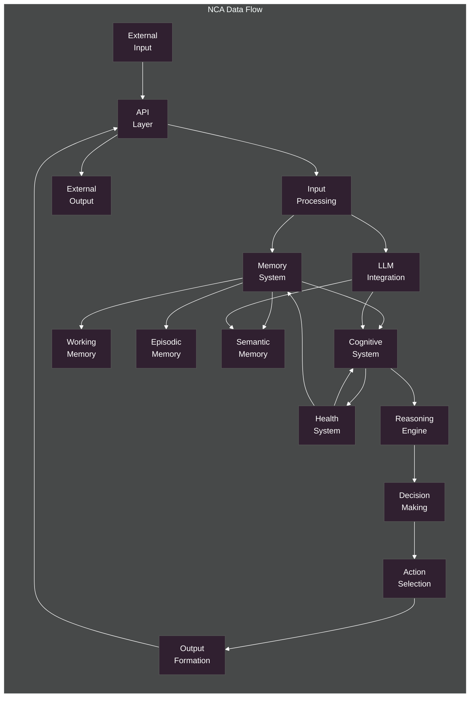

# Data Flow Architecture

Overview of data flows in the NeuroCognitive Architecture.

## Data Flow Architecture Components

The Data Flow Architecture shows how information moves through the NeuroCognitive Architecture system, from input to output.

### Main Data Flow
- **External Input**: Information entering the system from external sources
- **API Layer**: Entry and exit point for external interactions
- **Input Processing**: Initial processing of incoming information
- **Memory System**: Storage and retrieval of information in the three-tiered memory
- **Cognitive System**: Core cognitive processing components
- **Reasoning Engine**: Applies reasoning methods to information
- **Decision Making**: Makes decisions based on reasoning and goals
- **Action Selection**: Selects actions based on decisions
- **Output Formation**: Formats the selected actions for output
- **External Output**: Information leaving the system to external recipients

### Memory Flows
- Information flows between the Memory System and its three tiers: Working Memory, Episodic Memory, and Semantic Memory
- Each tier has different storage characteristics and retrieval patterns

### LLM Integration Flows
- The LLM Integration component receives processed input
- It provides processed information to both the Semantic Memory and Cognitive System
- This enables embeddings for memory storage and semantic understanding for reasoning

### Health System Flows
- The Health System monitors and regulates both the Cognitive System and Memory System
- It receives feedback from the Cognitive System to update health metrics
- This creates a feedback loop that maintains system health and performance

The flow architecture ensures that information is processed in a structured way, moving from input through processing and memory systems, to cognitive components, and finally to output, with health monitoring throughout.
