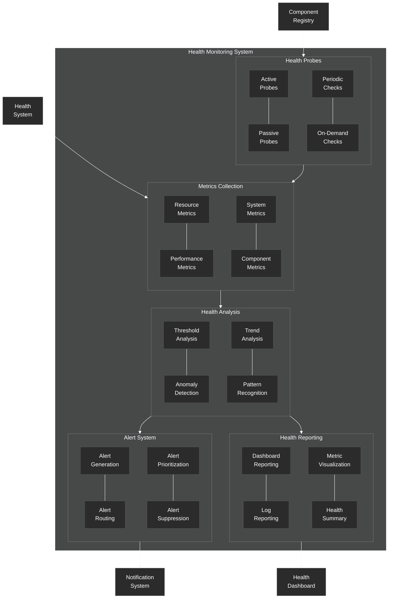

# Health Monitoring System

Details of the health monitoring system in the NeuroCognitive Architecture.

## Health Monitoring System Components

The Health Monitoring System is responsible for collecting, analyzing, and reporting on the health of the NeuroCognitive Architecture.

### Metrics Collection
- **Resource Metrics**: Collects metrics related to system resources (CPU, memory, storage)
- **Performance Metrics**: Gathers metrics on system performance and response times
- **System Metrics**: Collects overall system state and operation metrics
- **Component Metrics**: Gathers metrics specific to individual components

### Health Analysis
- **Threshold Analysis**: Compares metrics against predefined thresholds
- **Anomaly Detection**: Identifies unusual patterns or deviations from normal behavior
- **Trend Analysis**: Analyzes changes in metrics over time
- **Pattern Recognition**: Identifies known patterns that may indicate issues

### Alert System
- **Alert Generation**: Creates alerts when issues are detected
- **Alert Routing**: Routes alerts to appropriate handlers
- **Alert Prioritization**: Assigns priority levels to alerts
- **Alert Suppression**: Prevents duplicate or unnecessary alerts

### Health Reporting
- **Dashboard Reporting**: Presents health data in visual dashboards
- **Log Reporting**: Records health events and issues in logs
- **Metric Visualization**: Creates visual representations of health metrics
- **Health Summary**: Generates summaries of system health status

### Health Probes
- **Active Probes**: Actively test system components
- **Passive Probes**: Collect data without interfering with operation
- **Periodic Checks**: Regularly scheduled health checks
- **On-Demand Checks**: Health checks triggered by specific events

The Health Monitoring System integrates with the Component Registry to discover components to monitor and with the Health System to provide data for regulation decisions. It outputs alerts to the Notification System and provides visualizations and summaries to the Health Dashboard.
