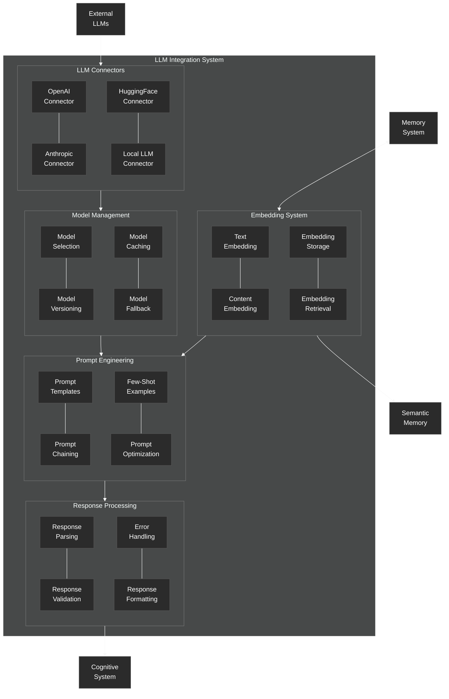

# LLM Integration System

Details of the LLM integration system in the NeuroCognitive Architecture.

## LLM Integration System Components

The LLM Integration System connects the NeuroCognitive Architecture with external Large Language Models, enabling semantic understanding and generation capabilities.

### LLM Connectors
- **OpenAI Connector**: Interfaces with OpenAI models (GPT-4, etc.)
- **Anthropic Connector**: Interfaces with Anthropic models (Claude, etc.)
- **HuggingFace Connector**: Connects to models hosted on HuggingFace
- **Local LLM Connector**: Interfaces with locally deployed LLMs

### Model Management
- **Model Selection**: Chooses appropriate models based on task requirements
- **Model Versioning**: Manages different versions of models
- **Model Caching**: Caches model results for efficiency
- **Model Fallback**: Provides fallback options when primary models fail

### Prompt Engineering
- **Prompt Templates**: Manages templates for different prompt types
- **Prompt Chaining**: Chains multiple prompts for complex tasks
- **Few-Shot Examples**: Provides examples for in-context learning
- **Prompt Optimization**: Optimizes prompts for better performance

### Embedding System
- **Text Embedding**: Converts text to vector embeddings
- **Content Embedding**: Embeds various content types (images, etc.)
- **Embedding Storage**: Stores embeddings for retrieval
- **Embedding Retrieval**: Retrieves embeddings for similarity search

### Response Processing
- **Response Parsing**: Parses structured data from LLM responses
- **Response Validation**: Validates responses against expected formats
- **Error Handling**: Manages errors in LLM interactions
- **Response Formatting**: Formats responses for downstream use

The LLM Integration System connects to External LLMs through the Connectors module and interacts bidirectionally with the Memory System, particularly for embedding storage and retrieval. It provides processed responses to the Cognitive System and sends embeddings to the Semantic Memory component.
