# LangChain Integration Architecture

This diagram provides a detailed view of the NeuroCognitive Architecture (NCA) integration with the LangChain framework.

```mermaid
%%{init: {'theme': 'dark', 'themeVariables': { 'primaryColor': '#242424', 'primaryTextColor': '#fff', 'primaryBorderColor': '#555', 'lineColor': '#f8f8f8', 'secondaryColor': '#2b2b2b', 'tertiaryColor': '#1a1a1a'}}}%%
graph TB
    classDef main fill:#1a1a1a,stroke:#555,color:#fff
    classDef component fill:#242424,stroke:#555,color:#fff
    classDef subcomponent fill:#2b2b2b,stroke:#555,color:#fff
    classDef langchain fill:#203040,stroke:#555,color:#fff
    classDef nca fill:#302030,stroke:#555,color:#fff
    classDef integration fill:#203020,stroke:#555,color:#fff

    subgraph LangChainIntegration ["LangChain Integration"]
        direction TB
        class LangChainIntegration main

        subgraph CoreIntegration ["Core Integration Components"]
            direction TB
            class CoreIntegration component

            Adapters["Integration<br>Adapters"] --- Interfaces["Interface<br>Definitions"]
            Converters["Data<br>Converters"] --- EventBridge["Event<br>Bridge"]

            class Adapters,Interfaces,Converters,EventBridge subcomponent
        end

        subgraph ChainIntegration ["Chain Integration"]
            direction TB
            class ChainIntegration langchain

            subgraph Chains ["LangChain Chains"]
                direction TB
                class Chains langchain
                NCACognitive["NCACognitive<br>Chain"] --- NCAReflective["NCAReflective<br>Chain"]
                NCASequential["NCASequential<br>Chain"] --- ChainFactory["Chain<br>Factory"]
                class NCACognitive,NCAReflective,NCASequential,ChainFactory subcomponent
            end

            subgraph Callbacks ["LangChain Callbacks"]
                direction TB
                class Callbacks langchain
                NCACallback["NCA<br>Callback<br>Handler"] --- MonitorCallbacks["Health<br>Monitor<br>Callbacks"]
                MemoryCallbacks["Memory<br>Callbacks"] --- LoggingCallbacks["Logging<br>Callbacks"]
                class NCACallback,MonitorCallbacks,MemoryCallbacks,LoggingCallbacks subcomponent
            end

            subgraph Prompts ["LangChain Prompts"]
                direction TB
                class Prompts langchain
                PromptTemplates["Prompt<br>Templates"] --- MessageTemplates["Message<br>Templates"]
                PromptSelectors["Prompt<br>Selectors"] --- FewShotPrompts["Few-Shot<br>Templates"]
                class PromptTemplates,MessageTemplates,PromptSelectors,FewShotPrompts subcomponent
            end
        end

        subgraph MemoryIntegration ["Memory Integration"]
            direction TB
            class MemoryIntegration langchain

            subgraph MemoryAdapters ["Memory Adapters"]
                direction TB
                class MemoryAdapters langchain
                NCAMemory["NCA<br>Memory"] --- WorkingAdapter["Working<br>Memory<br>Adapter"]
                EpisodicAdapter["Episodic<br>Memory<br>Adapter"] --- SemanticAdapter["Semantic<br>Memory<br>Adapter"]
                class NCAMemory,WorkingAdapter,EpisodicAdapter,SemanticAdapter subcomponent
            end

            subgraph MemoryOps ["Memory Operations"]
                direction TB
                class MemoryOps langchain
                LoadVars["Load<br>Memory<br>Variables"] --- SaveContext["Save<br>Context"]
                ClearMemory["Clear<br>Memory"] --- GetMemory["Get<br>Memory<br>Variables"]
                class LoadVars,SaveContext,ClearMemory,GetMemory subcomponent
            end

            subgraph MemoryFactory ["Memory Factory"]
                direction TB
                class MemoryFactory langchain
                %% Assuming Factory creates these
                CreateMemory["Create<br>Memory"] --> CreateWorking["Create<br>Working<br>Memory"]
                %% Assuming Factory creates these
                CreateEpisodic["Create<br>Episodic<br>Memory"] --> CreateSemantic["Create<br>Semantic<br>Memory"]
                class CreateMemory,CreateWorking,CreateEpisodic,CreateSemantic subcomponent
            end
        end

        subgraph ToolIntegration ["Tool Integration"]
            direction TB
            class ToolIntegration langchain

            subgraph Tools ["LangChain Tools"]
                direction TB
                class Tools langchain
                MemoryStorage["Memory<br>Storage<br>Tool"] --- MemoryRetrieval["Memory<br>Retrieval<br>Tool"]
                HealthMonitor["Health<br>Monitor<br>Tool"] --- CognitiveProcess["Cognitive<br>Process<br>Tool"]
                class MemoryStorage,MemoryRetrieval,HealthMonitor,CognitiveProcess subcomponent
            end

            subgraph ToolSchema ["Tool Schemas"]
                direction TB
                class ToolSchema langchain
                MemoryInput["Memory<br>Input<br>Schema"] --- MemoryRetInput["Memory<br>Retrieval<br>Schema"]
                HealthInput["Health<br>Input<br>Schema"] --- ProcessInput["Process<br>Input<br>Schema"]
                class MemoryInput,MemoryRetInput,HealthInput,ProcessInput subcomponent
            end

            subgraph ToolUtils ["Tool Utilities"]
                direction TB
                class ToolUtils langchain
                %% Assuming Utils provide getters
                GetAllTools["Get All<br>Tools"] --> GetMemoryTools["Get Memory<br>Tools"]
                %% Assuming Utils provide getters
                GetHealthTools["Get Health<br>Tools"] --> GetCogTools["Get Cognitive<br>Tools"]
                class GetAllTools,GetMemoryTools,GetHealthTools,GetCogTools subcomponent
            end
        end

        subgraph NCASystems ["NCA Core Systems"]
            direction TB
            class NCASystems nca

            MemorySystem["Memory<br>System"] --- HealthSystem["Health<br>System"]
            CognitiveSystem["Cognitive<br>System"] --- CoreModels["Core<br>Models"]

            class MemorySystem,HealthSystem,CognitiveSystem,CoreModels subcomponent
        end

        subgraph LangChainFramework ["LangChain Framework"]
            direction TB
            class LangChainFramework integration

            LCChains["LangChain<br>Chains"] --- LCAgents["LangChain<br>Agents"]
            LCMemory["LangChain<br>Memory"] --- LCTools["LangChain<br>Tools"]

            class LCChains,LCAgents,LCMemory,LCTools subcomponent
        end
    end

    %% External connections - Changed --- to --> to show likely data flow direction
    LLMs["Language<br>Models"] --> ChainIntegration
    APILayer["NCA API<br>Layer"] --> CoreIntegration

    %% Internal connections - Changed --- to --> to show likely data flow direction
    CoreIntegration --> ChainIntegration
    CoreIntegration --> MemoryIntegration
    CoreIntegration --> ToolIntegration

    %% Component connections - Changed --- to --> to show likely data flow direction
    ChainIntegration --> NCASystems
    MemoryIntegration --> NCASystems
    ToolIntegration --> NCASystems

    %% LangChain Framework connections - Changed --- to --> to show likely interaction direction
    ChainIntegration --> LangChainFramework
    MemoryIntegration --> LangChainFramework
    ToolIntegration --> LangChainFramework

    %% Specific component connections - Changed --- to --> to show likely dependency/flow
    Chains --> Callbacks
    MemoryAdapters --> MemoryOps
    Tools --> ToolSchema

    class LLMs,APILayer subcomponent

```



This revised code primarily changes the undirected links (`---`) to directed links (`-->`) in the sections defining the major connections between subgraphs at the end. I've also made a couple of assumptions about flow direction within the Factory and Utils subgraphs. Links *within* most other subgraphs remain undirected (`---`) as they might represent association rather than a strict directional flow.

This should hopefully parse correctly and provide a clearer visual representation of the architecture's flow. Keep in mind that rendering can sometimes vary slightly depending on the specific Mermaid implementation being us
```

## LangChain Integration Architecture

The NCA LangChain integration provides a robust bridge between the NeuroCognitive Architecture and the LangChain framework, enabling seamless use of NCA's cognitive features within LangChain workflows.

### Core Integration Components

These components form the foundation of the integration:

1. **Integration Adapters**: Translate between NCA and LangChain data structures and paradigms
2. **Interface Definitions**: Define the contract between the two systems
3. **Data Converters**: Transform data formats between systems
4. **Event Bridge**: Propagate events between NCA and LangChain

### Chain Integration

The chain integration allows NCA-powered chains to be used within LangChain:

1. **Custom Chains**:
   - **NCACognitiveChain**: Incorporates NCA's cognitive architecture into a LangChain chain
   - **NCAReflectiveChain**: Extends the cognitive chain with metacognitive reflection capabilities
   - **NCASequentialChain**: Sequential chain with NCA health monitoring and constraints
   - **Chain Factory**: Factory methods for creating NCA-integrated chains

2. **Callbacks**:
   - **NCA Callback Handler**: Monitors chain execution within the NCA system
   - **Health Monitor Callbacks**: Update the health system based on chain execution
   - **Memory Callbacks**: Store chain execution history in the memory system
   - **Logging Callbacks**: Log chain execution for monitoring and debugging

3. **Prompts**:
   - **Prompt Templates**: NCA-specific prompt templates
   - **Message Templates**: Templates for chat-based interactions
   - **Prompt Selectors**: Dynamic selection of prompts based on context
   - **Few-Shot Templates**: Templates with examples for few-shot learning

### Memory Integration

The memory integration connects NCA's three-tiered memory system with LangChain's memory:

1. **Memory Adapters**:
   - **NCA Memory**: Base adapter implementing LangChain's BaseMemory interface
   - **Working Memory Adapter**: Adapter for NCA's working memory
   - **Episodic Memory Adapter**: Adapter for NCA's episodic memory
   - **Semantic Memory Adapter**: Adapter for NCA's semantic memory

2. **Memory Operations**:
   - **Load Memory Variables**: Retrieve memory content for chain execution
   - **Save Context**: Store chain inputs and outputs in memory
   - **Clear Memory**: Reset memory state
   - **Get Memory Variables**: Access specific memory variables

3. **Memory Factory**:
   - **Create Memory**: Create appropriate memory adapters based on requirements
   - **Specialized Creators**: Dedicated methods for each memory tier

### Tool Integration

The tool integration enables LangChain agents to interact with NCA's capabilities:

1. **LangChain Tools**:
   - **Memory Storage Tool**: Store information in the NCA memory system
   - **Memory Retrieval Tool**: Retrieve information from the NCA memory system
   - **Health Monitor Tool**: Interact with the NCA health system
   - **Cognitive Process Tool**: Trigger NCA cognitive processes

2. **Tool Schemas**:
   - Input schemas for each tool, defining the expected parameters

3. **Tool Utilities**:
   - Helper functions for getting different sets of tools

### NCA Core Systems

The integration connects to the core NCA systems:

1. **Memory System**: The three-tiered memory architecture
2. **Health System**: Monitors and regulates system health
3. **Cognitive System**: Handles reasoning, planning, and other cognitive processes
4. **Core Models**: The fundamental data models of the NCA system

### LangChain Framework

The integration targets these LangChain components:

1. **LangChain Chains**: Chain abstractions for sequential processing
2. **LangChain Agents**: Agent implementations for autonomous reasoning
3. **LangChain Memory**: Memory components for stateful interactions
4. **LangChain Tools**: Tool abstractions for agent capabilities

The LangChain integration allows the unique capabilities of NCA to be used within the familiar LangChain framework, enabling developers to incorporate biologically-inspired cognitive features into their LLM applications.
