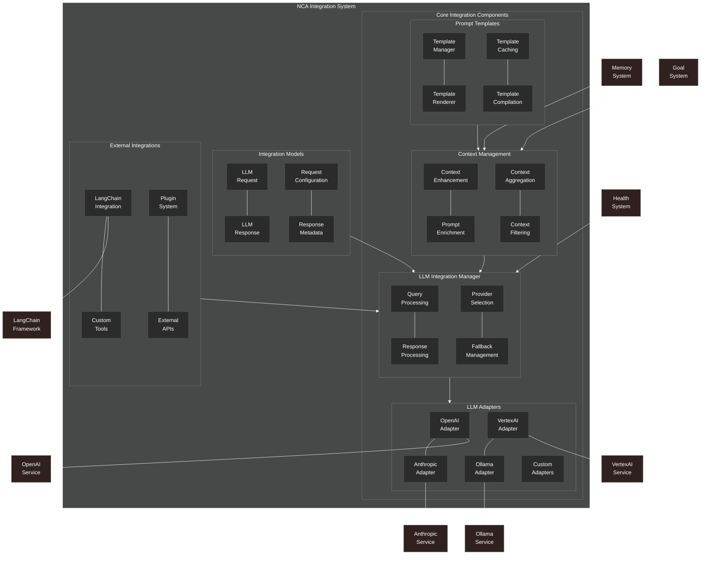

# Integration System Overview

This diagram provides a comprehensive overview of the NeuroCognitive Architecture (NCA) integration system.

## Integration System Components

The NCA integration system provides a framework for connecting the cognitive architecture with external LLM providers and frameworks. It consists of the following key components:

### Core Integration Components

1. **LLM Integration Manager**:
   - **Query Processing**: Processes and enhances queries before sending to LLMs
   - **Response Processing**: Processes and filters responses from LLMs
   - **Provider Selection**: Selects appropriate LLM provider based on requirements
   - **Fallback Management**: Handles fallbacks when primary providers fail

2. **LLM Adapters**:
   - **OpenAI Adapter**: Interface for OpenAI models
   - **Anthropic Adapter**: Interface for Anthropic models
   - **VertexAI Adapter**: Interface for Google's VertexAI models
   - **Ollama Adapter**: Interface for local Ollama models
   - **Custom Adapters**: Framework for custom LLM interfaces

3. **Context Management**:
   - **Context Enhancement**: Enhances prompts with context
   - **Prompt Enrichment**: Enriches prompts with cognitive capabilities
   - **Context Aggregation**: Combines context from different sources
   - **Context Filtering**: Filters context based on relevance

4. **Prompt Templates**:
   - **Template Manager**: Manages prompt templates
   - **Template Renderer**: Renders templates with variables
   - **Template Caching**: Caches templates for performance
   - **Template Compilation**: Compiles templates for efficient rendering

### Integration Models

1. **LLM Request**: Model for representing LLM requests
2. **LLM Response**: Model for representing LLM responses
3. **Request Configuration**: Configuration for LLM requests
4. **Response Metadata**: Metadata for LLM responses

### External Integrations

1. **LangChain Integration**: Integration with LangChain framework
2. **Custom Tools**: Custom tools for LLM interactions
3. **Plugin System**: Framework for plugins
4. **External APIs**: Connections to external APIs

### External Connections

The integration system connects with:
- **Memory System**: For retrieving relevant memories
- **Health System**: For health-aware adaptations
- **Goal System**: For goal-directed prompting

### Provider Connections

The integration system connects to external LLM providers:
- **OpenAI Service**: For OpenAI models
- **Anthropic Service**: For Anthropic models
- **VertexAI Service**: For Google's VertexAI models
- **Ollama Service**: For local Ollama models

The integration system is designed to provide a unified interface for interacting with various LLM providers while enhancing the interactions with NCA's cognitive capabilities.
