# Memory System Overview

This diagram provides a comprehensive overview of the NeuroCognitive Architecture (NCA) memory system.

```mermaid
%%{init: {'theme': 'dark', 'themeVariables': { 'primaryColor': '#242424', 'primaryTextColor': '#fff', 'primaryBorderColor': '#555', 'lineColor': '#f8f8f8', 'secondaryColor': '#2b2b2b', 'tertiaryColor': '#1a1a1a'}}}%%
graph TB
    classDef main fill:#1a1a1a,stroke:#555,color:#fff
    classDef component fill:#242424,stroke:#555,color:#fff
    classDef subcomponent fill:#2b2b2b,stroke:#555,color:#fff
    classDef tier fill:#203040,stroke:#555,color:#fff
    classDef backend fill:#302030,stroke:#555,color:#fff
    classDef manager fill:#203020,stroke:#555,color:#fff

    subgraph MemorySystem["NCA Memory System"]
        direction TB
        class MemorySystem main

        subgraph Tiers["Memory Tiers"]
            direction TB
            class Tiers component
            
            subgraph WorkingMemory["Working Memory"]
                direction TB
                class WorkingMemory tier
                ShortTerm[Short-term<br>Storage] --- Decay[Decay<br>Mechanism]
                Capacity[Limited<br>Capacity] --- Retention[Short<br>Retention]
                class ShortTerm,Decay,Capacity,Retention subcomponent
            end
            
            subgraph EpisodicMemory["Episodic Memory"]
                direction TB
                class EpisodicMemory tier
                Episodes[Episode<br>Storage] --- Contexts[Context<br>Binding]
                Temporal[Temporal<br>Ordering] --- Experiential[Experiential<br>Data]
                class Episodes,Contexts,Temporal,Experiential subcomponent
            end
            
            subgraph SemanticMemory["Semantic Memory"]
                direction TB
                class SemanticMemory tier
                Knowledge[Knowledge<br>Storage] --- Concepts[Concept<br>Networks]
                Facts[Factual<br>Data] --- Relations[Relational<br>Maps]
                class Knowledge,Concepts,Facts,Relations subcomponent
            end
        end

        subgraph Manager["Memory Manager"]
            direction TB
            class Manager component
            
            subgraph StorageManager["Storage Manager"]
                direction TB
                class StorageManager manager
                Store[Store<br>Operation] --- Retrieve[Retrieve<br>Operation]
                Delete[Delete<br>Operation] --- Update[Update<br>Operation]
                class Store,Retrieve,Delete,Update subcomponent
            end
            
            subgraph ProcessingSystem["Processing System"]
                direction TB
                class ProcessingSystem manager
                Indexing[Indexing<br>System] --- Search[Search<br>System]
                Embedding[Embedding<br>System] --- Relevance[Relevance<br>Scoring]
                class Indexing,Search,Embedding,Relevance subcomponent
            end
            
            subgraph MaintenanceSystem["Maintenance System"]
                direction TB
                class MaintenanceSystem manager
                Consolidation[Memory<br>Consolidation] --- GC[Garbage<br>Collection]
                Annealing[Memory<br>Annealing] --- Optimization[Memory<br>Optimization]
                class Consolidation,GC,Annealing,Optimization subcomponent
            end
            
            subgraph TubuleSystem["Tubule System"]
                direction TB
                class TubuleSystem manager
                Connection[Memory<br>Connections] --- Transfer[Memory<br>Transfer]
                Pathways[Neural<br>Pathways] --- Integration[Memory<br>Integration]
                class Connection,Transfer,Pathways,Integration subcomponent
            end
            
            subgraph LymphaticSystem["Lymphatic System"]
                direction TB
                class LymphaticSystem manager
                Cleaning[Memory<br>Cleaning] --- Pruning[Memory<br>Pruning]
                Maintenance[Health<br>Maintenance] --- Repair[Memory<br>Repair]
                class Cleaning,Pruning,Maintenance,Repair subcomponent
            end
        end

        subgraph Backends["Storage Backends"]
            direction LR
            class Backends component
            
            subgraph InMemory["In-Memory Backend"]
                direction TB
                class InMemory backend
                RAM[RAM<br>Storage] --- Volatile[Volatile<br>Storage]
                class RAM,Volatile subcomponent
            end
            
            subgraph SQLite["SQLite Backend"]
                direction TB
                class SQLite backend
                LocalDB[Local<br>Database] --- CRUD[CRUD<br>Operations]
                Schema[Database<br>Schema] --- Indices[DB<br>Indices]
                class LocalDB,CRUD,Schema,Indices subcomponent
            end
            
            subgraph Redis["Redis Backend"]
                direction TB
                class Redis backend
                KeyValue[Key-Value<br>Store] --- Cache[Caching<br>Layer]
                PubSub[Pub/Sub<br>System] --- TTL[Time-to-Live]
                class KeyValue,Cache,PubSub,TTL subcomponent
            end
            
            subgraph Vector["Vector Storage Backend"]
                direction TB
                class Vector backend
                VectorDB[Vector<br>Database] --- Similarity[Similarity<br>Search]
                Dimensions[Dimension<br>Reduction] --- Clustering[Vector<br>Clustering]
                class VectorDB,Similarity,Dimensions,Clustering subcomponent
            end
        end

        subgraph Adapters["Memory Adapters"]
            direction TB
            class Adapters component
            CoreAdapter[Core<br>Adapter] --- LangChain[LangChain<br>Adapter]
            ExternalAdapter[External<br>Adapter] --- CustomAdapter[Custom<br>Adapter]
            class CoreAdapter,LangChain,ExternalAdapter,CustomAdapter subcomponent
        end

        subgraph Models["Memory Models"]
            direction TB
            class Models component
            MemoryItem[Memory<br>Item] --- MemoryQuery[Memory<br>Query]
            MemoryType[Memory<br>Type] --- MemoryStats[Memory<br>Stats]
            class MemoryItem,MemoryQuery,MemoryType,MemoryStats subcomponent
        end
    end
    
    %% External connections
    Core[Core<br>Components] --> Manager
    API[API<br>Layer] --> Adapters
    Integration[Integration<br>Layer] --> Adapters
    
    %% Internal connections
    Manager --> Tiers
    Manager --> Backends
    Adapters --> Tiers
    Adapters --> Manager
    Models --> Tiers
    Models --> Manager
    Models --> Backends
    
    %% Inter-tier connections
    WorkingMemory --> EpisodicMemory
    EpisodicMemory --> SemanticMemory
    
    %% Memory Manager internal connections
    StorageManager --> ProcessingSystem
    ProcessingSystem --> MaintenanceSystem
    MaintenanceSystem --> TubuleSystem
    TubuleSystem --> LymphaticSystem
    
    %% Node styling
    class Core,API,Integration subcomponent
```

## Key Components

### Memory Tiers

1. **Working Memory**: Short-term, limited capacity storage for active processing
   - Short retention time with automatic decay mechanism
   - Limited capacity (Miller's Law: 7±2 items)
   - Currently active information for immediate reasoning

2. **Episodic Memory**: Medium-term memory for experiences and events
   - Stores contextual and temporal information
   - Experiential data tied to specific events or interactions
   - Episodes can be recalled based on relevance to current context

3. **Semantic Memory**: Long-term storage for facts, knowledge, and concepts
   - Stores conceptual relationships and factual information
   - Knowledge networks and concept maps
   - Persistent, long-term knowledge storage

### Memory Manager

The memory manager orchestrates the interaction between memory tiers and backends:

1. **Storage Manager**: Handles basic CRUD operations on memory items
2. **Processing System**: Manages indexing, search, embedding, and relevance scoring
3. **Maintenance System**: Handles memory consolidation, garbage collection, annealing, and optimization
4. **Tubule System**: Manages memory connections and transfer between memory tiers
5. **Lymphatic System**: Responsible for memory cleaning, pruning, health maintenance, and repair

### Storage Backends

Multiple backend options for physical storage of memory data:

1. **In-Memory Backend**: Fast, volatile RAM-based storage
2. **SQLite Backend**: Persistent local database storage
3. **Redis Backend**: Key-value store with caching capabilities
4. **Vector Storage Backend**: Specialized storage for vector embeddings and similarity search

### Adapters & Models

1. **Memory Adapters**: Interface between memory system and other components
2. **Memory Models**: Data structures and types defining memory items, queries, and statistics

The memory system is highly modular, allowing different backends to be swapped out based on deployment requirements and scale.
