# Memory Tiers Architecture

This diagram provides a detailed view of the NeuroCognitive Architecture (NCA) memory tier system, focusing on the interaction between the three memory tiers.

```mermaid
%%{init: {'theme': 'dark', 'themeVariables': { 'primaryColor': '#242424', 'primaryTextColor': '#fff', 'primaryBorderColor': '#555', 'lineColor': '#f8f8f8', 'secondaryColor': '#2b2b2b', 'tertiaryColor': '#1a1a1a'}}}%%
graph TB
    classDef main fill:#1a1a1a,stroke:#555,color:#fff
    classDef component fill:#242424,stroke:#555,color:#fff
    classDef subcomponent fill:#2b2b2b,stroke:#555,color:#fff
    classDef working fill:#203040,stroke:#555,color:#fff
    classDef episodic fill:#303020,stroke:#555,color:#fff
    classDef semantic fill:#302030,stroke:#555,color:#fff
    classDef interface fill:#203030,stroke:#555,color:#fff

    subgraph TierSystem["Memory Tier System"]
        direction TB
        class TierSystem main
        
        subgraph Interfaces["Memory Interfaces"]
            direction TB
            class Interfaces interface
            API[Memory API] --- Config[Memory Config]
            Events[Memory Events] --- Metrics[Memory Metrics]
            class API,Config,Events,Metrics subcomponent
        end
        
        subgraph WorkingMem["Working Memory (STM)"]
            direction TB
            class WorkingMem working
            
            subgraph STMCore["Working Memory Core"]
                direction TB
                class STMCore working
                Buffer[Memory<br>Buffer] --- Attention[Attention<br>Focus]
                Chunking[Memory<br>Chunking] --- Rehearsal[Active<br>Rehearsal]
                class Buffer,Attention,Chunking,Rehearsal subcomponent
            end
            
            subgraph STMProcessing["Working Memory Processing"]
                direction TB
                class STMProcessing working
                Encoding[STM<br>Encoding] --- Retrieval[STM<br>Retrieval]
                DecayMech[Decay<br>Mechanism] --- Displacement[Item<br>Displacement]
                class Encoding,Retrieval,DecayMech,Displacement subcomponent
            end
            
            subgraph STMProperties["Working Memory Properties"]
                direction TB
                class STMProperties working
                Capacity[Limited<br>Capacity] --- Duration[Short<br>Duration]
                Volatility[High<br>Volatility] --- Accessibility[Immediate<br>Access]
                class Capacity,Duration,Volatility,Accessibility subcomponent
            end
        end
        
        subgraph EpisodicMem["Episodic Memory (EM)"]
            direction TB
            class EpisodicMem episodic
            
            subgraph EMCore["Episodic Memory Core"]
                direction TB
                class EMCore episodic
                Episodes[Episode<br>Store] --- Context[Context<br>Binding]
                Temporal[Temporal<br>Sequencing] --- Spatial[Spatial<br>Information]
                class Episodes,Context,Temporal,Spatial subcomponent
            end
            
            subgraph EMProcessing["Episodic Memory Processing"]
                direction TB
                class EMProcessing episodic
                Encoding[EM<br>Encoding] --- Retrieval[EM<br>Retrieval]
                Consolidation[Memory<br>Consolidation] --- Reconsolidation[Memory<br>Reconsolidation]
                class Encoding,Retrieval,Consolidation,Reconsolidation subcomponent
            end
            
            subgraph EMProperties["Episodic Memory Properties"]
                direction TB
                class EMProperties episodic
                Capacity[Medium<br>Capacity] --- Duration[Medium<br>Duration]
                Autobiographical[Autobiographical<br>Content] --- EventBased[Event-Based<br>Structure]
                class Capacity,Duration,Autobiographical,EventBased subcomponent
            end
        end
        
        subgraph SemanticMem["Semantic Memory (LTM)"]
            direction TB
            class SemanticMem semantic
            
            subgraph LTMCore["Semantic Memory Core"]
                direction TB
                class LTMCore semantic
                Knowledge[Knowledge<br>Base] --- Concepts[Concept<br>Network]
                Facts[Factual<br>Information] --- Schemas[Schema<br>Organization]
                class Knowledge,Concepts,Facts,Schemas subcomponent
            end
            
            subgraph LTMProcessing["Semantic Memory Processing"]
                direction TB
                class LTMProcessing semantic
                Encoding[LTM<br>Encoding] --- Retrieval[LTM<br>Retrieval]
                Embedding[Semantic<br>Embedding] --- Association[Semantic<br>Association]
                class Encoding,Retrieval,Embedding,Association subcomponent
            end
            
            subgraph LTMProperties["Semantic Memory Properties"]
                direction TB
                class LTMProperties semantic
                Capacity[Large<br>Capacity] --- Duration[Long<br>Duration]
                Structure[Hierarchical<br>Structure] --- Persistence[High<br>Persistence]
                class Capacity,Duration,Structure,Persistence subcomponent
            end
        end
        
        subgraph TierInteractions["Memory Tier Interactions"]
            direction TB
            class TierInteractions component
            Consolidation[Memory<br>Consolidation] --- Transfer[Memory<br>Transfer]
            Promotion[Memory<br>Promotion] --- Degradation[Memory<br>Degradation]
            class Consolidation,Transfer,Promotion,Degradation subcomponent
        end
        
        subgraph CrossTierFunctions["Cross-Tier Functions"]
            direction TB
            class CrossTierFunctions component
            Search[Cross-Tier<br>Search] --- Recall[Assisted<br>Recall]
            Integration[Memory<br>Integration] --- Reinforcement[Memory<br>Reinforcement]
            class Search,Recall,Integration,Reinforcement subcomponent
        end
    end
    
    %% External connections
    MemoryManager[Memory<br>Manager] --> Interfaces
    TubuleSystem[Tubule<br>System] --> TierInteractions
    
    %% Internal connections
    Interfaces --> WorkingMem
    Interfaces --> EpisodicMem
    Interfaces --> SemanticMem
    
    %% Tier processing connections
    STMCore --> STMProcessing
    STMProcessing --> STMProperties
    EMCore --> EMProcessing
    EMProcessing --> EMProperties
    LTMCore --> LTMProcessing
    LTMProcessing --> LTMProperties
    
    %% Tier interaction connections
    WorkingMem --> TierInteractions
    EpisodicMem --> TierInteractions
    SemanticMem --> TierInteractions
    TierInteractions --> CrossTierFunctions
    
    %% Direct memory paths
    WorkingMem -- "Consolidation" --> EpisodicMem
    EpisodicMem -- "Consolidation" --> SemanticMem
    SemanticMem -- "Activation" --> EpisodicMem
    EpisodicMem -- "Retrieval" --> WorkingMem
    
    %% Node styling
    class MemoryManager,TubuleSystem subcomponent
```

## Memory Tier System

The NCA memory system is organized into three biologically-inspired tiers that work together to provide a comprehensive memory architecture:

### Working Memory (Short-Term Memory)

The Working Memory tier is responsible for temporarily holding information that is currently being processed:

1. **Core Components**:
   - Memory Buffer: Temporary storage area for active items
   - Attention Focus: Directs processing resources to specific items
   - Memory Chunking: Groups related items to increase effective capacity
   - Active Rehearsal: Maintains items through continuous activation

2. **Processing**:
   - Encoding/Retrieval: Fast storage and access mechanisms
   - Decay Mechanism: Automatic fading of memory items over time
   - Item Displacement: Replacement of older items when capacity is reached

3. **Properties**:
   - Limited Capacity: Follows Miller's Law (7±2 items)
   - Short Duration: Items persist for seconds to minutes without rehearsal
   - High Volatility: Easily disrupted by distractions
   - Immediate Access: No retrieval delay for items in working memory

### Episodic Memory (Medium-Term Memory)

The Episodic Memory tier stores experiences and events with their associated contexts:

1. **Core Components**:
   - Episode Store: Storage for complete episodic memories
   - Context Binding: Attaches contextual information to episodes
   - Temporal Sequencing: Maintains chronological order of episodes
   - Spatial Information: Records spatial context of memories

2. **Processing**:
   - Encoding/Retrieval: Mechanisms for storing and accessing episodes
   - Consolidation: Process of stabilizing memories after initial encoding
   - Reconsolidation: Modification of existing memories upon retrieval

3. **Properties**:
   - Medium Capacity: Larger than working memory, smaller than semantic
   - Medium Duration: Memories persist for days to years
   - Autobiographical Content: Personally experienced events
   - Event-Based Structure: Organized around discrete episodes

### Semantic Memory (Long-Term Memory)

The Semantic Memory tier provides long-term storage for general knowledge and facts:

1. **Core Components**:
   - Knowledge Base: Repository of general knowledge
   - Concept Network: Interconnected network of concepts and their relationships
   - Factual Information: Storage for facts independent of episodic context
   - Schema Organization: Structured frameworks for organizing knowledge

2. **Processing**:
   - Encoding/Retrieval: Mechanisms for storing and accessing semantic information
   - Semantic Embedding: Vector representations of concepts
   - Semantic Association: Connections between related concepts

3. **Properties**:
   - Large Capacity: Virtually unlimited storage
   - Long Duration: Persistent storage for years to lifetime
   - Hierarchical Structure: Organized in taxonomic networks
   - High Persistence: Resistant to decay over time

### Memory Tier Interactions

The memory tiers interact through several mechanisms:

1. **Consolidation**: Process by which memories are transferred from working memory to episodic memory, and from episodic to semantic memory
2. **Memory Transfer**: Movement of information between tiers based on relevance and usage
3. **Memory Promotion**: Elevation of important memories to more persistent tiers
4. **Memory Degradation**: Gradual fading of memories that aren't accessed frequently

### Cross-Tier Functions

Several functions operate across all memory tiers:

1. **Cross-Tier Search**: Ability to search for information across all memory tiers
2. **Assisted Recall**: Using information from one tier to aid retrieval from another
3. **Memory Integration**: Combining information from multiple tiers
4. **Memory Reinforcement**: Strengthening memories through repeated activation

The memory tier system is designed to mimic human memory processes, with information flowing between tiers based on frequency of use, relevance, and importance.
