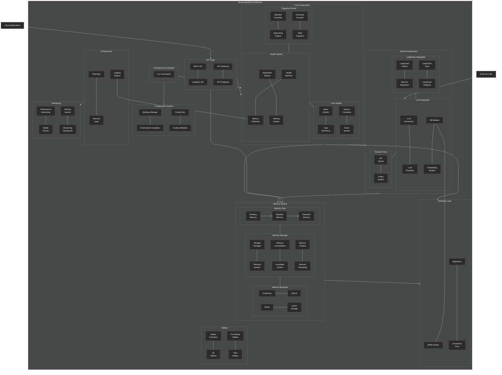

# NCA System Architecture

This diagram provides a high-level overview of the complete NeuroCognitive Architecture (NCA) system, based on the actual codebase structure.

## Key Components

1. **API Layer**: Exposes NCA functionality through REST and GraphQL interfaces, with defined schemas and endpoints
2. **CLI**: Command-line interface for interacting with the system
3. **Configuration System**: Manages settings, environment variables, and configuration files
4. **Core Components**:
   - **Cognitive Control**: Manages attention, reasoning, executive function, and metacognition
   - **Health System**: Monitors and regulates system health, fatigue, and cognitive load
   - **Core Models**: Defines base models, types, constants, and event system
5. **Memory System**:
   - **Memory Tiers**: Working, episodic, and semantic memory tiers
   - **Memory Manager**: Manages storage, retrieval, consolidation, and includes specialized subsystems like lymphatic system, tubules, and annealing
   - **Memory Backends**: Various storage backends including in-memory, SQLite, Redis, and vector storage
6. **External Integrations**:
   - **LangChain Integration**: Connects with LangChain framework through chains, memory integration, tools, and adapters
   - **LLM Integration**: Interfaces with various language models through connectors, providers, model management, and embedding models
   - **External Tools**: API clients and plugin system for external tools
7. **Database Layer**: Models, ORM system, migrations, and connection pool
8. **Infrastructure**: Logging, metrics collection, telemetry, and security
9. **Monitoring**: Performance monitoring, health checks, alerting system, and dashboard
10. **Utilities**: Helper functions, I/O utilities, formatting utilities, and time utilities

The architecture follows a modular design with clear separation of concerns, allowing for flexible integration with external systems while maintaining the cognitive architecture's biological inspiration.
